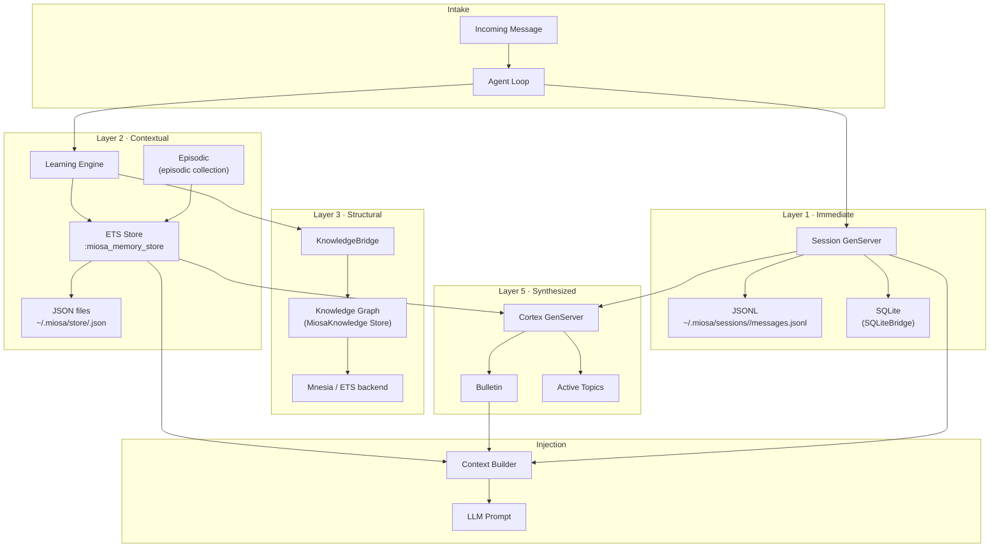

# Memory System — Architecture Overview

The OSA memory system provides agents with durable, queryable knowledge across five distinct layers that span from within-request immediacy to cross-session synthesis.

## 5-Layer Architecture

```
┌─────────────────────────────────────────────────────────────────┐
│                        OSA Memory Stack                         │
│                                                                 │
│  Layer 5 ──── SYNTHESIZED ──────────────────────────────────   │
│               Cortex (MiosaMemory.Cortex)                       │
│               Bulletins · Active Topics · Session Summaries     │
│               ↑ reads from layers 2, 3, 4                       │
│                                                                 │
│  Layer 4 ──── DISCOVERABLE ─────────────────────────────────   │
│               Full-text search (MiosaMemory.Store.ETS search)   │
│               Collection-scoped keyword matching across all     │
│               stored entries                                    │
│                                                                 │
│  Layer 3 ──── STRUCTURAL ────────────────────────────────────   │
│               Knowledge Graph (MiosaKnowledge via KnowledgeBridge)│
│               RDF triples · SPARQL queries · OWL 2 RL reasoning │
│                                                                 │
│  Layer 2 ──── CONTEXTUAL ────────────────────────────────────   │
│               Long-term memory (MiosaMemory.Store.ETS)          │
│               Patterns · Solutions · Decisions · Episodic events│
│               Persisted to ~/.miosa/store/ as JSON              │
│                                                                 │
│  Layer 1 ──── IMMEDIATE ─────────────────────────────────────   │
│               Session (MiosaMemory.Session + SQLiteBridge)      │
│               Conversation messages in memory + SQLite + JSONL  │
└─────────────────────────────────────────────────────────────────┘
```

## Layer Descriptions

| Layer | Name | Module(s) | Persistence | Scope |
|-------|------|-----------|-------------|-------|
| 1 | Immediate | `MiosaMemory.Session`, `SQLiteBridge` | JSONL + SQLite | Per-session |
| 2 | Contextual | `MiosaMemory.Store.ETS`, `MiosaMemory.Episodic` | JSON files (optional) | Cross-session |
| 3 | Structural | `MiosaKnowledge`, `KnowledgeBridge` | Mnesia (prod) / ETS (test) | Global |
| 4 | Discoverable | `MiosaMemory.Store.ETS.search/2` | Derived from layer 2 | Cross-session |
| 5 | Synthesized | `MiosaMemory.Cortex` | In-memory (GenServer) | Cross-session |

## Data Flow



## Supervision Tree (AgentServices)

All memory processes start under `OptimalSystemAgent.Supervisors.AgentServices` with `:one_for_one` restart strategy:

```
AgentServices Supervisor
├── Agent.Memory          → MiosaMemory.Store (ETS store GenServer)
├── Agent.Learning        → MiosaMemory.Learning (pattern/solution GenServer)
├── Agent.Memory.KnowledgeBridge  → syncs Learning → knowledge graph every 60s
├── MiosaKnowledge.Store  → knowledge graph (Mnesia prod, ETS test)
├── Agent.Compactor       → MiosaMemory.Compactor (context compaction)
└── Agent.Cortex          → MiosaMemory.Cortex (synthesis GenServer)
```

Session GenServers are started on demand under `MiosaMemory.SessionSupervisor` (a `DynamicSupervisor`), registered via `MiosaMemory.SessionRegistry`.

## OSA Alias Modules

OSA exposes compatibility aliases under its own namespace that delegate to `miosa_memory`. These exist for backward compatibility and to provide a stable OSA-scoped API surface:

| OSA alias | Delegates to |
|-----------|-------------|
| `Agent.Memory` | `MiosaMemory.Store` |
| `Agent.Learning` | `MiosaMemory.Learning` |
| `Agent.Cortex` | `MiosaMemory.Cortex` |
| `Agent.Memory.Taxonomy` | `MiosaMemory.Taxonomy` |
| `Agent.Memory.Injector` | `MiosaMemory.Injector` |
| `Agent.Memory.Episodic` | `MiosaMemory.Episodic` |

The `SQLiteBridge` and `KnowledgeBridge` are OSA-specific — they have no miosa_memory counterpart.

## Configuration

```elixir
# config/config.exs

# ETS store persistence (layer 2)
config :miosa_memory, MiosaMemory.Store.ETS,
  persist: true,
  persist_path: "~/.miosa/store"

# Session JSONL persistence (layer 1)
config :miosa_memory, MiosaMemory.Session,
  session_path: "~/.miosa/sessions",
  auto_persist_interval: 10      # persist every N messages

# SQLite secondary store (layer 1)
config :miosa_memory, secondary_store: OptimalSystemAgent.Agent.Memory.SQLiteBridge

# Context compaction thresholds (layer 5)
config :miosa_memory, MiosaMemory.Compactor,
  warn_at: 0.85,
  compact_at: 0.90,
  hard_stop: 0.95
```

## See Also

- [memory-store.md](./memory-store.md) — Layer 1 & 2: session + long-term store internals
- [episodic.md](./episodic.md) — Episodic event recording and decay
- [learning.md](./learning.md) — Learning engine: patterns, solutions, consolidation
- [cortex.md](./cortex.md) — Layer 5: synthesis, bulletins, active topics
- [taxonomy.md](./taxonomy.md) — Classification system used by Taxonomy and Injector
