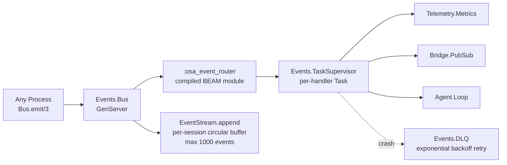

# Data Flow

Audience: senior Elixir engineers who need to understand how data is transformed
as it moves through OSA, from raw channel input to LLM completion to tool
execution and back.

This document is complementary to [execution-flow.md](execution-flow.md), which
covers the sequence of process interactions. This document focuses on data shapes
and transformation at each stage.

---

## Stage 1: Raw String to Signal Tuple

A message arrives as a plain binary (UTF-8 string) from a channel adapter. The
first transformation classifies it using Signal Theory.

### Input

```elixir
# From any channel adapter (e.g. HTTP handler, Telegram webhook)
raw_message = "Read the README and summarize it for me"
```

### Classification

`MiosaSignal.MessageClassifier.classify_deterministic/2` runs deterministic
regex matching against the raw string:

```elixir
defmodule MiosaSignal.MessageClassifier do
  def classify_deterministic(message, _channel) when is_binary(message) do
    msg = String.downcase(message)
    mode = cond do
      Regex.match?(~r/\b(analyze|report|compare|review)\b/, msg) -> :analyze
      true -> :assist
    end
    genre = cond do
      Regex.match?(~r/\b(please|can you|could you|do|make)\b/, msg) -> :direct
      true -> :inform
    end
    weight = min(String.length(message) / 500.0, 1.0)
    {:ok, %__MODULE__{mode: mode, genre: genre, weight: Float.round(weight, 2), ...}}
  end
end
```

### Output: MiosaSignal.MessageClassifier struct

```elixir
%MiosaSignal.MessageClassifier{
  mode: :analyze,
  genre: :direct,
  type: "general",
  format: :text,
  weight: 0.08,          # 40-char message / 500 = 0.08
  raw: "Read the README and summarize it for me",
  channel: :http,
  timestamp: ~U[2026-03-14 12:00:00Z],
  confidence: :low
}
```

The `weight` is passed forward as `signal_weight` in the opts list to
`Agent.Loop.process_message/3`. The raw string is what actually gets stored and
reasoned about — the Signal struct is used only for routing decisions.

---

## Stage 2: Signal Weight to Noise Filter Decision

The noise filter receives the raw string and the weight float. It returns a
routing decision, not a transformed value.

```elixir
# OptimalSystemAgent.Channels.NoiseFilter.check/2
@spec check(String.t(), float() | nil) ::
        :pass | {:filtered, String.t()} | {:clarify, String.t()}

check("Read the README and summarize it for me", 0.08)
# => :pass  (Tier 1 regex finds no match; weight >= 0.35 threshold... wait)
# Actually: weight=0.08 < likely_noise=0.35 → {:filtered, "Got it."}
```

Note: a 40-character message produces weight 0.08, which falls below the
`likely_noise` threshold (0.35). The noise filter will acknowledge this message
and return early. This demonstrates that weight-only filtering can be aggressive
for short but meaningful messages — callers should pass `signal_weight: nil` when
no upstream classifier has run.

---

## Stage 3: Raw String to Conversation Message Map

When a message passes the noise filter, it is persisted to the JSONL session log
as a message map:

```elixir
# OptimalSystemAgent.Agent.Memory.append/2
memory_entry = %{
  role: "user",
  content: "Read the README and summarize it for me",
  channel: :http
}
```

This map shape is the canonical unit throughout the agent loop. The `messages`
list in `Agent.Loop` state is a list of such maps, following the OpenAI message
format. System messages have `role: "system"`.

---

## Stage 4: Message List to Context (System Prompt Assembly)

`OptimalSystemAgent.Agent.Context.build/1` receives the `Agent.Loop` state and
produces a `%{messages: [system_msg | conversation]}` map.

### Tier 1: Static Base (cached)

```elixir
# OptimalSystemAgent.Soul.static_base/0
# Returns from persistent_term after first interpolation:
static_base = :persistent_term.get({Soul, :static_base})
# Binary string: SYSTEM.md with {{TOOL_DEFINITIONS}}, {{RULES}}, {{USER_PROFILE}} expanded
```

### Tier 2: Dynamic Context (per-request)

```elixir
# assembled from blocks, token-budgeted:
dynamic_context = """
## Runtime
- Working dir: /Users/alice/project
- OS: macOS 25.3.0

## Memory
[recent episodic entries matching message keywords]

## Tasks
[active tasks from Agent.Tasks]
"""
```

### Token Budget Calculation

```elixir
max_tok = MiosaProviders.Registry.context_window(model)
# e.g. 200_000 for claude-sonnet-4-6

dynamic_budget =
  max(max_tok - @response_reserve - conversation_tokens - static_tokens, 1_000)
# = max(200_000 - 8_192 - 320 - 12_000, 1_000) = 179_488
```

### Output: Messages List

For Anthropic providers, the system message is split into two content blocks to
enable prompt caching:

```elixir
%{
  messages: [
    %{
      role: "system",
      content: [
        %{type: "text", text: static_base,
          cache_control: %{type: "ephemeral"}},   # Tier 1, cached
        %{type: "text", text: dynamic_context}    # Tier 2, uncached
      ]
    },
    %{role: "user", content: "Read the README and summarize it for me"}
  ]
}
```

For all other providers:

```elixir
%{
  messages: [
    %{role: "system", content: static_base <> "\n\n" <> dynamic_context},
    %{role: "user", content: "Read the README and summarize it for me"}
  ]
}
```

---

## Stage 5: LLM Request and Response Parsing

### Request Shape (sent to Anthropic)

`OptimalSystemAgent.Providers.Anthropic.chat/2` formats the messages and tools
into the Anthropic API body:

```elixir
%{
  model: "claude-sonnet-4-6",
  max_tokens: 8192,
  system: [
    %{type: "text", text: static_base, cache_control: %{type: "ephemeral"}},
    %{type: "text", text: dynamic_context}
  ],
  messages: [
    %{role: "user", content: "Read the README and summarize it for me"}
  ],
  tools: [
    %{
      name: "file_read",
      description: "Read a file from the filesystem...",
      input_schema: %{"type" => "object", "properties" => %{"path" => %{"type" => "string"}}, ...}
    },
    # ... 41 more tools
  ]
}
```

### Raw API Response

```json
{
  "content": [
    {
      "type": "tool_use",
      "id": "toolu_01ABC",
      "name": "file_read",
      "input": {"path": "README.md"}
    }
  ],
  "stop_reason": "tool_use",
  "usage": {"input_tokens": 12430, "output_tokens": 45}
}
```

### Parsed to Canonical Form

`Providers.Anthropic` normalizes the response:

```elixir
{:ok, %{
  content: "",
  tool_calls: [
    %{id: "toolu_01ABC", name: "file_read", arguments: %{"path" => "README.md"}}
  ],
  usage: %{input_tokens: 12430, output_tokens: 45}
}}
```

This canonical shape is identical regardless of provider. All provider adapters
must return this structure. OpenAI-compatible providers parse `tool_calls` from
the `message.tool_calls` array. Ollama local models may embed tool calls as XML
in the text content — `Providers.ToolCallParsers` extracts them using seven
model-family parsers (Hermes, DeepSeek, Mistral, Llama, GLM, Kimi, Qwen3-Coder).

---

## Stage 6: Tool Call to Tool Result

When the LLM response contains `tool_calls`, each call is validated and executed.

### Input: Tool Call Map

```elixir
%{id: "toolu_01ABC", name: "file_read", arguments: %{"path" => "README.md"}}
```

### Argument Validation

`Tools.Registry.validate_arguments/2` resolves the tool's JSON Schema and validates:

```elixir
schema = %{
  "type" => "object",
  "properties" => %{
    "path" => %{"type" => "string", "description" => "Path to read"}
  },
  "required" => ["path"]
}
resolved = ExJsonSchema.Schema.resolve(schema)
ExJsonSchema.Validator.validate(resolved, %{"path" => "README.md"})
# => :ok
```

Validation failures return `{:error, "Tool 'file_read' argument validation failed:\n  - ..."}`.
The error string is appended to the conversation as a tool result and re-prompted.

### Execution

```elixir
# OptimalSystemAgent.Tools.Builtins.FileRead.execute/1
execute(%{"path" => "README.md"})
# => {:ok, "# OSA\n\nOptimal System Agent...\n[content continues]"}
```

### Tool Result Message

The result is appended to the conversation messages list in the format required
by the active provider. For Anthropic:

```elixir
%{
  role: "user",
  content: [
    %{
      type: "tool_result",
      tool_use_id: "toolu_01ABC",
      content: "# OSA\n\nOptimal System Agent...\n"
    }
  ]
}
```

For OpenAI-compatible providers:

```elixir
%{
  role: "tool",
  tool_call_id: "toolu_01ABC",
  content: "# OSA\n\nOptimal System Agent...\n"
}
```

The message list grows by one entry per tool call/result pair. On the next LLM
call, the model receives the entire expanded conversation.

---

## Stage 7: Final Response to Delivery

When the LLM produces a message with no tool calls (`tool_calls == []`), the
content string is the final response.

### Output Guardrail

Before delivery, `Guardrails.response_contains_prompt_leak?/1` checks whether
the response accidentally echoed the system prompt (can happen with weak local
models). If detected, a refusal message replaces the content.

### Memory Persistence

```elixir
# Appended to JSONL session log:
Memory.append(state.session_id, %{
  role: "assistant",
  content: "The README describes OSA as..."
})

# Episodic memory record:
Episodic.record(:agent_response, %{
  content: "The README describes OSA as...",
  session_id: state.session_id,
  turn: state.turn_count
}, state.session_id)
```

### Channel Delivery

The response string is delivered through the channel adapter's `send_message/3`:

```elixir
# For HTTP channel — SSE stream push:
Phoenix.PubSub.broadcast(
  OptimalSystemAgent.PubSub,
  "session:#{session_id}",
  {:agent_response, response_text}
)

# For Telegram:
Req.post("https://api.telegram.org/bot#{token}/sendMessage",
  json: %{chat_id: chat_id, text: response_text, parse_mode: "Markdown"})
```

---

## Persistent Term Layout

`persistent_term` holds read-heavy, write-once-or-rarely data for lock-free
access from any process:

| Key | Content | Written by | Read by |
|-----|---------|-----------|---------|
| `{Soul, :static_base}` | Interpolated SYSTEM.md string | `Soul.static_base/0` (lazy, once) | `Agent.Context.build/1` every LLM call |
| `{Soul, :static_token_count}` | Token count of static base | Same | `Agent.Context.build/1` |
| `{Tools.Registry, :builtin_tools}` | `%{name => module}` map | `Tools.Registry.init/1` | Every tool execution, every context build |
| `{Tools.Registry, :mcp_tools}` | `%{prefixed_name => info}` map | `Tools.Registry.register_mcp_tools/0` (async post-boot) | Every tool execution |
| `{Tools.Registry, :skills}` | `%{name => skill_map}` map | `Tools.Registry.init/1` | Context build, skill trigger matching |

---

## ETS Table Layout

Named ETS tables hold hot state that multiple processes read and write concurrently:

| Table | Type | Access | Purpose |
|-------|------|--------|---------|
| `:osa_cancel_flags` | `set, public` | `Loop.cancel/1` writes; `run_loop` reads | Per-session loop cancellation |
| `:osa_files_read` | `set, public` | Tool hooks write; hook reads | Read-before-write tracking |
| `:osa_survey_answers` | `set, public` | HTTP handler writes; `ask_user` polls | `ask_user` survey responses |
| `:osa_context_cache` | `set, public` | `Providers.Registry` reads/writes | Ollama model context window cache |
| `:osa_session_provider_overrides` | `set, public` | Hot-swap API writes; `Loop.apply_overrides` reads | Per-session model overrides |
| `:osa_pending_questions` | `set, public` | `ask_user` writes; HTTP reads | Pending `ask_user` question tracking |
| `:osa_hooks` | `bag, public` | `Hooks.GenServer` writes; `Hooks.run` reads | Hook registrations (bag = multiple per event) |
| `:osa_hooks_metrics` | `set, public, write_concurrency: true` | `Hooks.run` writes | Hook timing counters |

---

## Event Bus Architecture

`Events.Bus` is the central nervous system for observability and decoupled inter-process
communication. It uses goldrush to compile event dispatch predicates into real BEAM bytecode
modules at startup, eliminating runtime pattern matching overhead on the hot path.



### goldrush compilation

At `Events.Bus.init/1`, a BEAM module is compiled from a query that matches any of the 14
known event type atoms:

```elixir
type_filters = Enum.map(@event_types, &:glc.eq(:type, &1))
query = :glc.with(:glc.any(type_filters), fn event -> dispatch_event(event) end)
:glc.compile(:osa_event_router, query)
```

At emit time, dispatch runs in a supervised Task:

```elixir
Task.Supervisor.start_child(Events.TaskSupervisor, fn ->
  :glc.handle(:osa_event_router, gre_event)
end)
```

The goldrush module runs at BEAM instruction speed. `dispatch_event/1` reads registered handlers
from `:osa_event_handlers` ETS at call time — handlers are dynamic; the compiled module is
static. The goldrush module is compiled once at init and never recompiled (recompilation causes a
TOCTOU race with `gr_param`'s internal ETS tables).

### Event types

| Type | Source | Primary Consumers |
|---|---|---|
| `user_message` | Channel adapters | Agent.Loop, Telemetry.Metrics, EventStream |
| `llm_request` | Loop.LLMClient | Telemetry.Metrics, EventStream |
| `llm_response` | MiosaProviders | Agent.Loop, Telemetry.Metrics, EventStream |
| `tool_call` | Loop.ToolExecutor | Telemetry.Metrics, EventStream |
| `tool_result` | Loop.ToolExecutor | Telemetry.Metrics, EventStream |
| `agent_response` | Agent.Loop | Bridge.PubSub, Webhooks.Dispatcher, EventStream |
| `system_event` | Various | Telemetry.Metrics, Learning |
| `channel_connected` | Channel adapters | HeartbeatState |
| `channel_disconnected` | Channel adapters | HeartbeatState |
| `channel_error` | Channel adapters | Telemetry.Metrics |
| `ask_user_question` | Agent.Loop | EventStream, SSE clients |
| `survey_answered` | HTTP endpoint | Agent.Loop (ETS poll) |
| `algedonic_alert` | DLQ, FailureModes | ProactiveMode, Fleet, Telemetry |
| `signal_classified` | Events.Classifier | Agent.Loop, EventStream |

---

## Dead Letter Queue

When a handler Task crashes, `dispatch_with_dlq/3` enqueues the failed event in `Events.DLQ`:

```elixir
Events.DLQ.enqueue(event_type, payload, handler, error_reason)
```

Retry schedule with exponential backoff (base 1s, cap 30s):

```
1st failure → enqueue → wait 1s → retry
2nd failure → wait 2s → retry
3rd failure → wait 4s → retry
Exhausted   → drop + emit algedonic_alert(:high, "DLQ exhausted")
```

The DLQ is ETS-backed (`:osa_dlq`, `set, public`). No persistence across restarts — events are
ephemeral; the learning engine captures durable failure patterns separately.

---

## Per-Session Event Stream (SSE)

`EventStream` maintains a per-session circular buffer (max 1000 events) for SSE delivery. Every
`Events.Bus.emit/3` call that carries a `session_id` appends to the buffer non-blocking:

```elixir
if typed_event.session_id do
  Events.Stream.append(typed_event.session_id, typed_event)
end
```

SSE clients tail the buffer via `GET /sessions/:id/stream`. The `Bridge.PubSub` component
broadcasts `agent_response` events to `Phoenix.PubSub` topics for fan-out to multiple SSE
subscribers on the same session.

---

## Signal Theory Failure Mode Detection

`Events.FailureModes.detect/1` is sampled 1-in-10 events on the hot path:

```elixir
if :rand.uniform(10) == 1 do
  violations = FailureModes.detect(typed_event)
  Enum.each(violations, fn {mode, desc} ->
    Logger.warning("[Bus] Signal failure mode #{mode}: #{desc}")
  end)
end
```

Critical violations emit `algedonic_alert` events — Beer's VSM concept for urgent bypass signals
that propagate immediately to health management processes.

---

## Cross-References

- Execution sequence: [execution-flow.md](execution-flow.md)
- Component inventory: [component-model.md](component-model.md)
- Extension points: [extension-points.md](extension-points.md)
- Startup sequence: [lifecycle.md](lifecycle.md)
