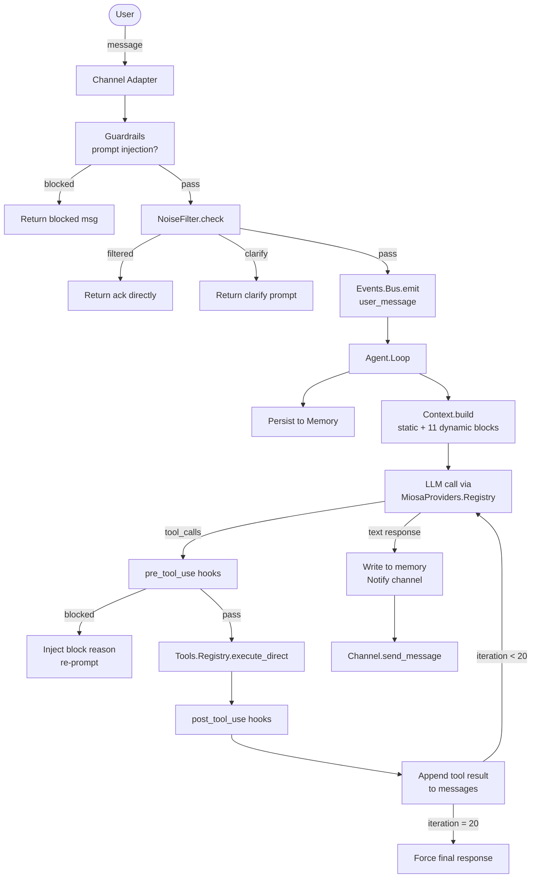
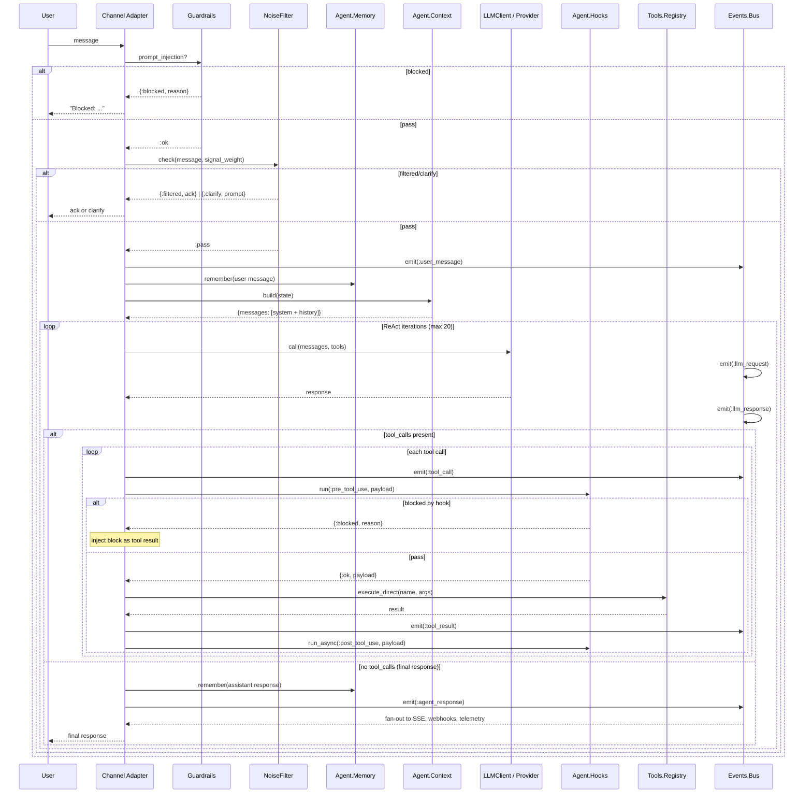

# Execution Flow

This document traces the path a user message takes from channel receipt to final response. The
numbered steps map to actual code locations in the codebase.

---

## Overview



---

## Step 1 — Channel Receives Message

A message enters OSA through one of 12 channel adapters. Each adapter implements
`Channels.Behaviour` and calls `Agent.Loop.process_message/2` (or `process_message/3` with signal
metadata) to hand off the message to the session loop.

**Example: HTTP channel**

```
POST /sessions/:id/messages
Content-Type: application/json
{"content": "Read the README and summarize it"}
```

The HTTP handler extracts `session_id` and `content`, looks up the `Agent.Loop` PID via
`Registry.lookup(SessionRegistry, session_id)`, and calls:

```elixir
GenServer.call(loop_pid, {:message, user_input, channel_opts})
```

If no session exists for the ID, the HTTP handler creates one via:

```elixir
DynamicSupervisor.start_child(SessionSupervisor, {Agent.Loop, session_opts})
```

**Example: CLI channel**

The CLI adapter reads from stdin and calls `Agent.Loop.process_message/2` directly. The CLI
runs in a tight read loop within its GenServer, forwarding each line.

---

## Step 2 — Prompt Injection Guard

**Module:** `Agent.Loop.Guardrails`

Before any other processing, the loop checks for prompt injection attempts:

```elixir
case Guardrails.prompt_injection?(user_input) do
  {:blocked, reason} ->
    # Hard stop. Do NOT write to memory. Return immediately.
    notify_channel(state, "Blocked: #{reason}")
    {:reply, :blocked, state}
  :ok ->
    # Continue to noise filter
end
```

`Guardrails.prompt_injection?/1` applies a pattern library of known injection techniques:
system-role injection, instruction override patterns, jailbreak templates, and context boundary
attacks. A blocked message is never persisted to memory.

---

## Step 3 — Noise Filter

**Module:** `Channels.NoiseFilter`

The noise filter short-circuits low-signal messages before they are persisted or sent to the LLM.
This reduces unnecessary LLM calls by 40–60% in typical chat usage.

```elixir
case NoiseFilter.check(user_input, signal_weight) do
  :pass ->
    # Continue to memory write and LLM
    process_substantive_message(state, user_input)

  {:filtered, ack} ->
    # Return ack directly. No memory write. No LLM call.
    notify_channel(state, ack)
    {:reply, :ok, state}

  {:clarify, prompt} ->
    # Return clarification request. No memory write. No LLM call.
    notify_channel(state, prompt)
    {:reply, :ok, state}
end
```

**Tier 1** (deterministic regex, <1ms): Single characters, filler words ("ok", "sure", "lol"),
emoji-only strings, pure punctuation.

**Tier 2** (signal weight): If the channel provides a `signal_weight` float (0.0–1.0):
- `< 0.35` → filtered with acknowledgment
- `0.35–0.65` → uncertain, return clarification prompt
- `≥ 0.65` → pass (process normally)

---

## Step 4 — Persist User Message to Memory

**Module:** `Agent.Memory`

```elixir
Agent.Memory.remember(session_id, %{role: "user", content: user_input, timestamp: now()})
```

Messages are written to both the in-process GenServer state and persisted asynchronously to
SQLite via `Store.Repo`. The GenServer state holds the active conversation window. SQLite is the
durable record for session replay and compaction.

An `Events.Bus.emit(:user_message, ...)` event is fired after persistence. This enables
`Telemetry.Metrics`, the `EventStream` (SSE), and any registered bus handlers to observe the
event without coupling to the loop.

---

## Step 5 — Build Context

**Module:** `Agent.Context`

`Context.build/1` assembles the full message list (system prompt + conversation history) within
the configured token budget.

### Tier 1 — Static Base (cached)

```elixir
static_base = Soul.static_base()         # from :persistent_term
static_tokens = Soul.static_token_count()
```

The static base is `SYSTEM.md` interpolated with tool definitions, rules, and user profile. It
is cached in `:persistent_term` at boot and never recomputed within a session.

For Anthropic providers, the static base is sent as a separate content block with
`cache_control: %{type: "ephemeral"}`, achieving ~90% input token cache hit rates after the
first call.

### Tier 2 — Dynamic Context (per-request, token-budgeted)

```elixir
dynamic_budget = max(max_tokens - response_reserve - conversation_tokens - static_tokens, 1_000)
```

11 dynamic blocks are gathered and fitted within the budget:

| Block | Priority | Content |
|---|---|---|
| `tool_process` | 1 | Tool usage instructions and working directory |
| `runtime` | 1 | Timestamp, channel, session ID, conversation depth |
| `environment` | 1 | Working dir, date, provider/model, git branch/status |
| `plan_mode` | 1 | Plan mode instructions (if active) |
| `memory` | 1 | Relevant long-term memories (keyword-filtered) |
| `episodic` | 1 | Last 10 session events (tool calls, tool results) |
| `task_state` | 1 | Active tasks with status icons |
| `workflow` | 1 | Multi-step workflow progress |
| `skills` | 2 | Active custom skills + trigger-matched skill instructions |
| `scratchpad` | 1 | Extended thinking scratchpad instruction (provider-dependent) |
| `vault` | 2 | Active vault context bundle |

Token estimation uses `Go.Tokenizer.count_tokens/1` (accurate BPE) when the Go sidecar is
running, falling back to a word-count heuristic otherwise.

### Token Budget Calculation

```
max_tokens          (model-specific, e.g. 200,000 for Claude claude-sonnet-4-6)
- response_reserve  (8,192 tokens reserved for LLM response)
- conversation_tokens (rolling window of messages)
- static_tokens     (cached base size)
= dynamic_budget    (available for 11 dynamic blocks)
```

Blocks that exceed the remaining budget are truncated at word boundaries with a
`[...truncated...]` suffix.

---

## Step 6 — LLM Call

**Module:** `Agent.Loop.LLMClient`

```elixir
context = Context.build(state)
tools = Tools.Registry.list_tools_direct()

response = LLMClient.call(
  messages: context.messages,
  tools: tools,
  provider: state.provider,
  model: state.model,
  stream: stream_callback
)
```

`LLMClient.call/1` routes to `MiosaProviders.Registry`, which dispatches to the active provider.
The provider adapter handles:
- Request formatting (messages → provider-specific schema)
- Authentication headers
- Streaming response assembly
- Token usage extraction

`Events.Bus.emit(:llm_request, ...)` fires before the call. `Events.Bus.emit(:llm_response, ...)`
fires after. These events are observable by `Telemetry.Metrics` and the SSE stream.

If the provider returns an error (rate limit, timeout, context overflow), `LLMClient` applies
retry logic with exponential backoff before propagating the error.

---

## Step 7 — Tool Execution Loop (max 20 iterations)

When the LLM response contains `tool_calls`, the loop enters the ReAct iteration:

```elixir
defp run_loop(state, messages, iteration) when iteration < @max_iterations do
  case LLMClient.call(messages: messages, tools: tools) do
    {:ok, %{tool_calls: [_ | _] = calls}} ->
      # Execute all tool calls in this batch
      results = execute_tools(calls, state)
      # Append assistant message + tool results to messages
      new_messages = messages ++ [assistant_msg(calls)] ++ results
      # Re-prompt
      run_loop(state, new_messages, iteration + 1)

    {:ok, %{content: final_text}} ->
      # No tool calls — final response
      {:ok, final_text}
  end
end

defp run_loop(state, messages, @max_iterations) do
  # Force a final response without tools to prevent infinite loops
  LLMClient.call(messages: messages, tools: [], force_text: true)
end
```

### Pre-tool hook pipeline

Before each tool execution:

```elixir
pre_payload = %{
  tool_name: call.name,
  arguments: call.arguments,
  session_id: state.session_id,
  provider: state.provider,
  model: state.model
}

case Hooks.run(:pre_tool_use, pre_payload) do
  {:ok, updated_payload} ->
    # Proceed with (possibly modified) payload
    execute_tool(updated_payload)

  {:blocked, reason} ->
    # Inject block reason as tool result — do not execute the tool
    %{role: "tool", name: call.name, content: "Blocked: #{reason}"}
end
```

Built-in `pre_tool_use` hooks (in priority order):

1. **spend_guard** (p8) — `MiosaBudget.Budget.check_budget/0`. Blocks if budget exceeded.
2. **security_check** (p10) — `Security.ShellPolicy.validate/1`. Blocks dangerous shell commands
   (e.g., `rm -rf /`, `:(){ :|:& };:` fork bombs, credential exfiltration patterns).
3. **read_before_write** (p12) — Nudges (does not block) when `file_edit` or `file_write` targets
   an existing file that has not been read in this session. Adds a `:nudge` key to the payload;
   max 2 nudges per file per session.
4. **mcp_cache** (p15) — If the tool is an MCP tool (`mcp_` prefix) and a schema is cached in
   `:persistent_term` (< 1 hour old), injects it into the payload as `:cached_schema`.

**Events.Bus.emit(:tool_call, ...)** fires before hook execution. This makes tool calls observable
by the SSE stream and Command Center in real time.

### Tool execution

```elixir
result = Tools.Registry.execute_direct(tool_name, arguments)
```

`execute_direct/2` reads the tool module from `:persistent_term` (lock-free, no GenServer call).
For MCP tools (prefixed `mcp_`), it routes to `MCP.Client.call_tool/2`.

JSON Schema validation runs against the tool's `parameters/0` schema via `ExJsonSchema` before
dispatch. Validation failures return a structured error string that the LLM can read and correct.

### Post-tool hook pipeline

After each tool execution:

```elixir
post_payload = Map.merge(pre_payload, %{
  result: result,
  duration_ms: elapsed,
  tokens_in: ...,
  tokens_out: ...
})

Hooks.run_async(:post_tool_use, post_payload)
```

`run_async` fires the hook chain in a separate Task — post-tool results are observational and
must not block the loop. Built-in `post_tool_use` hooks:

1. **track_files_read** (p5) — Records the file path in `:osa_files_read` ETS after successful
   `file_read`, `dir_list`, or `file_glob` calls.
2. **mcp_cache_post** (p15) — Caches MCP tool results in `:persistent_term` with timestamp.
3. **cost_tracker** (p25) — `MiosaBudget.Budget.record_cost/5`. Records actual token spend.
4. **vault_auto_checkpoint** (p80) — Calls `Vault.checkpoint/1` every 10 tool calls.
5. **telemetry** (p90) — `Events.Bus.emit(:system_event, %{event: :tool_telemetry, ...})`.

**Events.Bus.emit(:tool_result, ...)** fires after execution. The tool result (truncated if
very large) appears in the SSE stream.

### Cancel flag check

At the start of each loop iteration, the loop checks the `:osa_cancel_flags` ETS table:

```elixir
case :ets.lookup(:osa_cancel_flags, state.session_id) do
  [{_, true}] ->
    :ets.delete(:osa_cancel_flags, state.session_id)
    {:cancelled, "Loop cancelled by user"}

  _ ->
    :continue
end
```

`Agent.Loop.cancel/1` sets this flag from any process, enabling the user to interrupt a running
tool chain (e.g., via `/cancel` CLI command or `DELETE /sessions/:id/run`).

---

## Step 8 — Final Response

When the LLM returns a response with no `tool_calls` (or after forced final response at iteration
20), the loop:

1. **Emits** `Events.Bus.emit(:agent_response, %{content: response, session_id: ...})`
2. **Writes to memory:**
   ```elixir
   Agent.Memory.remember(session_id, %{role: "assistant", content: response, timestamp: now()})
   ```
3. **Notifies the channel:**
   ```elixir
   channel_adapter.send_message(chat_id, response)
   ```
4. **Appends to the session's message list** for the next turn's conversation context.

`Events.Bus.emit(:agent_response, ...)` fans out to:
- `Bridge.PubSub` → `Phoenix.PubSub` topics → SSE clients streaming the session
- `Webhooks.Dispatcher` → configured webhook endpoints
- `Telemetry.Metrics` → response latency tracking
- `EventStream.append/2` → per-session SSE circular buffer

---

## Full Sequence Diagram



---

## Plan Mode

When the session is in plan mode (`state.plan_mode == true`), the loop modifies step 6:

1. The `plan_mode` dynamic context block is injected (instructs the LLM to produce a plan, not
   execute tools).
2. `LLMClient.call/1` is called with an **empty tools list** — the LLM cannot invoke any tools.
3. The LLM returns a structured plan (Goal, Steps, Files, Risks, Estimate).
4. The plan is returned as the final response. No tool execution loop runs.

Plan mode is toggled via `/plan` slash command or by setting `plan_mode: true` in session options.

---

## Genre Routing

**Module:** `Agent.Loop.GenreRouter`

Before entering the full ReAct loop, the GenreRouter may short-circuit the response for specific
signal genres:

```elixir
case GenreRouter.route(message, state.genre) do
  {:canned, response} ->
    # Return pre-built response without LLM call
    notify_channel(state, response)

  :full_loop ->
    # Continue to normal context build + LLM call
    run_full_loop(state, message)
end
```

Genres that may return canned responses include low-cost conversational greetings where the
Signal Theory genre classifier has high confidence that no reasoning is required.

---

## Concurrent Session Isolation

Each `Agent.Loop` is an isolated GenServer. Multiple sessions run in parallel without shared
state. The only shared resources are:

- **ETS tables** (`:osa_cancel_flags`, `:osa_files_read`) — keyed by `session_id`, no cross-session
  access.
- **Agent.Memory** — the GenServer serializes writes, but `Memory.recall/0` returns the shared
  long-term memory that all sessions read from. Session-specific episodic memory is maintained
  separately.
- **Tools.Registry** — read-only `:persistent_term` lookups; execution runs in the caller's
  process (no GenServer serialization under concurrent load).
- **MiosaBudget.Budget** — shared budget counter; per-session spend is tracked alongside global
  totals.
