# System Architecture

OSA (Optimal System Agent) is a production-grade, 154K-line Elixir/OTP AI agent runtime. It
delivers bounded ReAct-loop reasoning, Signal Theory message routing, multi-channel I/O, and an
extension system for optional subsystems — all within a single OTP application that tolerates
component failures without losing the session layer.

## Design Philosophy

**Fault containment via supervision hierarchy.** The OTP supervision tree is the primary resilience
mechanism. A crash in any single process restarts only that process (or, for rest_for_one
supervisors, that process and its dependents). The user-facing session layer survives infrastructure
restarts wherever process isolation allows.

**Zero-copy hot paths.** goldrush-compiled BEAM bytecode modules (`osa_event_router`,
`osa_tool_dispatcher`) handle event dispatch and tool routing at BEAM instruction speed. ETS and
`:persistent_term` back the hot-read paths so GenServer bottlenecks do not appear under concurrent
load.

**Opt-in extensions.** Every subsystem beyond the minimal agent loop is conditionally started via
environment flags. The application boots to a usable state on minimal configuration and grows into
optional capabilities (treasury, fleet, swarm, AMQP, etc.) at runtime.

---

## Top-Level Supervision Tree

The root supervisor is `OptimalSystemAgent.Supervisor`, strategy `:rest_for_one`. Children start
left-to-right and are restarted in that order on failure. A crash in an earlier child restarts all
later children.

```
OptimalSystemAgent.Supervisor  (rest_for_one)
├── [Platform.Repo]             (opt-in, if DATABASE_URL / platform_enabled)
├── Task.Supervisor             (OptimalSystemAgent.TaskSupervisor)
├── Supervisors.Infrastructure  (rest_for_one)
├── Supervisors.Sessions        (one_for_one)
├── Supervisors.AgentServices   (one_for_one)
├── Supervisors.Extensions      (one_for_one)
├── Channels.Starter            (GenServer, deferred channel startup)
└── Bandit                      (HTTP server, port 8089)
```

`Platform.Repo` (PostgreSQL, optional) is placed before `Infrastructure` so the platform database
is available to any infrastructure child that needs it during `init/1`.

`Bandit` is placed last so the HTTP API surface is only available after all agent processes are
ready to serve requests.

---

## Subsystem: Infrastructure

**Supervisor:** `OptimalSystemAgent.Supervisors.Infrastructure`
**Strategy:** `:rest_for_one`

Children have ordering dependencies. `Events.TaskSupervisor` must exist before `Events.Bus`
spawns its supervised tasks. `Events.Bus` must precede `Events.DLQ` and `Bridge.PubSub`.
`MiosaLLM.HealthChecker` must precede `MiosaProviders.Registry`.

```
Supervisors.Infrastructure  (rest_for_one)
├── Registry              (SessionRegistry, keys: :unique)
├── Task.Supervisor       (Events.TaskSupervisor, max_children: 100)
├── Phoenix.PubSub        (name: OptimalSystemAgent.PubSub)
├── Events.Bus            (goldrush-compiled :osa_event_router)
├── Events.DLQ            (dead-letter queue, exponential backoff)
├── Bridge.PubSub         (cross-process pub/sub bridge)
├── Store.Repo            (SQLite3 via Ecto)
├── EventStream           (SSE circular buffer, Command Center)
├── Telemetry.Metrics     (subscribes to Events.Bus)
├── MiosaLLM.HealthChecker (circuit breaker for LLM providers)
├── MiosaProviders.Registry (goldrush-compiled :osa_provider_router)
├── Tools.Registry        (goldrush-compiled :osa_tool_dispatcher)
├── Tools.Cache           (tool result memoization)
├── Machines              (OS template discovery)
├── Commands              (slash command registry)
├── OS.Registry           (OS template connection registry)
├── Registry              (MCP.Registry, keys: :unique)
└── DynamicSupervisor     (MCP.Supervisor, one_for_one)
```

---

## Subsystem: Sessions

**Supervisor:** `OptimalSystemAgent.Supervisors.Sessions`
**Strategy:** `:one_for_one`

A crashed channel adapter must not restart the event stream registry or the session supervisor.

```
Supervisors.Sessions  (one_for_one)
├── DynamicSupervisor   (Channels.Supervisor — channel adapters)
├── Registry            (EventStreamRegistry, keys: :unique)
└── DynamicSupervisor   (SessionSupervisor — Agent.Loop processes)
```

`Channels.Supervisor` dynamically starts up to 12 channel adapters:
CLI, HTTP, Telegram, Discord, Slack, Signal, WhatsApp, Email, Matrix, DingTalk, Feishu, QQ.

`SessionSupervisor` owns one `Agent.Loop` GenServer per active session. Sessions are created on
demand (via CLI, HTTP API, or SDK) and removed when the session terminates.

---

## Subsystem: AgentServices

**Supervisor:** `OptimalSystemAgent.Supervisors.AgentServices`
**Strategy:** `:one_for_one`

Agent services are independent. A Scheduler crash must not restart Memory or Orchestrator.

```
Supervisors.AgentServices  (one_for_one)
├── Agent.Memory             (long-term memory store)
├── Agent.HeartbeatState     (session heartbeat tracking)
├── Agent.Tasks              (task queue per session)
├── MiosaBudget.Budget       (API spend tracking)
├── Agent.Orchestrator       (multi-agent coordination)
├── Agent.Progress           (progress reporting)
├── Agent.Hooks              (middleware pipeline, ETS-backed)
├── Agent.Learning           (pattern/solution accumulation)
├── MiosaKnowledge.Store     (Mnesia/ETS knowledge backend)
├── Agent.Memory.KnowledgeBridge (bridges Memory → MiosaKnowledge)
├── Vault.Supervisor         (persistent secret/context store)
├── Agent.Scheduler          (scheduled task runner)
├── Agent.Compactor          (context window compaction)
├── Agent.Cortex             (multi-provider synthesis)
├── Agent.ProactiveMode      (proactive task initiation)
└── Webhooks.Dispatcher      (outbound webhook delivery)
```

`MiosaKnowledge.Store` uses Mnesia in production and ETS in the test environment for isolation.

---

## Subsystem: Extensions

**Supervisor:** `OptimalSystemAgent.Supervisors.Extensions`
**Strategy:** `:one_for_one`

All children are either opt-in (environment flags) or self-contained. Extensions start conditionally
and are independent from each other.

```
Supervisors.Extensions  (one_for_one)
├── [MiosaBudget.Treasury]                 (OSA_TREASURY_ENABLED=true)
├── Intelligence.Supervisor                (always, dormant until wired)
│   ├── Intelligence.ConversationTracker
│   ├── Intelligence.ContactDetector
│   └── Intelligence.ProactiveMonitor
├── Agent.Orchestrator.Mailbox             (always — ETS table for swarm)
├── Agent.Orchestrator.SwarmMode           (always — GenServer)
├── DynamicSupervisor  (SwarmMode.AgentPool, max_children: 50)
├── [Fleet.Supervisor]                     (OSA_FLEET_ENABLED=true)
├── Sidecar.Manager                        (always — creates circuit breaker tables)
├── [Go.Tokenizer]                         (go_tokenizer_enabled)
├── [Python.Supervisor]                    (python_sidecar_enabled)
├── [Go.Git]                               (go_git_enabled)
├── [Go.Sysmon]                            (go_sysmon_enabled)
├── [WhatsAppWeb]                          (whatsapp_web_enabled)
├── [Sandbox.Supervisor]                   (sandbox_enabled)
├── [Integrations.Wallet.Mock]             (wallet_enabled)
├── [Integrations.Wallet]                  (wallet_enabled)
├── [System.Updater]                       (update_enabled)
└── [Platform.AMQP]                        (AMQP_URL set)
```

---

## Full Supervision Tree (Mermaid)

```mermaid
graph TD
  APP["OptimalSystemAgent.Supervisor\nrest_for_one"]

  APP --> PREPO["[Platform.Repo]\nopt-in"]
  APP --> TASKS0["Task.Supervisor\nTaskSupervisor"]
  APP --> INFRA["Supervisors.Infrastructure\nrest_for_one"]
  APP --> SESS["Supervisors.Sessions\none_for_one"]
  APP --> AGSVC["Supervisors.AgentServices\none_for_one"]
  APP --> EXT["Supervisors.Extensions\none_for_one"]
  APP --> STARTER["Channels.Starter"]
  APP --> BANDIT["Bandit\nport 8089"]

  INFRA --> SR["SessionRegistry"]
  INFRA --> ETS["Events.TaskSupervisor"]
  INFRA --> PPUB["Phoenix.PubSub"]
  INFRA --> EBUS["Events.Bus\nosa_event_router"]
  INFRA --> EDLQ["Events.DLQ"]
  INFRA --> BPUB["Bridge.PubSub"]
  INFRA --> REPO["Store.Repo\nSQLite3"]
  INFRA --> ESTREAM["EventStream\nSSE buffer"]
  INFRA --> TEL["Telemetry.Metrics"]
  INFRA --> HCK["MiosaLLM.HealthChecker"]
  INFRA --> PREG["MiosaProviders.Registry"]
  INFRA --> TREG["Tools.Registry\nosa_tool_dispatcher"]
  INFRA --> TCACHE["Tools.Cache"]
  INFRA --> MACH["Machines"]
  INFRA --> CMDS["Commands"]
  INFRA --> OSREG["OS.Registry"]
  INFRA --> MCPREG["MCP.Registry"]
  INFRA --> MCPSUP["MCP.Supervisor\nDynamicSupervisor"]

  SESS --> CHANSUP["Channels.Supervisor\nDynamicSupervisor"]
  SESS --> ESREG["EventStreamRegistry"]
  SESS --> SESSUP["SessionSupervisor\nDynamicSupervisor"]

  CHANSUP --> CLI["CLI"]
  CHANSUP --> HTTP["HTTP"]
  CHANSUP --> TG["Telegram"]
  CHANSUP --> DC["Discord"]
  CHANSUP --> SL["Slack"]
  CHANSUP --> SIG["Signal"]
  CHANSUP --> WA["WhatsApp"]
  CHANSUP --> EM["Email"]
  CHANSUP --> MX["Matrix"]
  CHANSUP --> DT["DingTalk"]
  CHANSUP --> FL["Feishu"]
  CHANSUP --> QQ["QQ"]

  SESSUP --> LOOP["Agent.Loop\n(per session)"]

  AGSVC --> MEM["Agent.Memory"]
  AGSVC --> HB["Agent.HeartbeatState"]
  AGSVC --> ATASKS["Agent.Tasks"]
  AGSVC --> BUD["MiosaBudget.Budget"]
  AGSVC --> ORCH["Agent.Orchestrator"]
  AGSVC --> PROG["Agent.Progress"]
  AGSVC --> HOOKS["Agent.Hooks"]
  AGSVC --> LEARN["Agent.Learning"]
  AGSVC --> KSTORE["MiosaKnowledge.Store"]
  AGSVC --> KBRID["Agent.Memory.KnowledgeBridge"]
  AGSVC --> VAULT["Vault.Supervisor"]
  AGSVC --> SCHED["Agent.Scheduler"]
  AGSVC --> COMP["Agent.Compactor"]
  AGSVC --> CORTEX["Agent.Cortex"]
  AGSVC --> PROACT["Agent.ProactiveMode"]
  AGSVC --> WHOOK["Webhooks.Dispatcher"]

  EXT --> TREAS["[Treasury]\nopt-in"]
  EXT --> INTEL["Intelligence.Supervisor"]
  EXT --> MBOX["Orchestrator.Mailbox"]
  EXT --> SWARM["Orchestrator.SwarmMode"]
  EXT --> POOL["SwarmMode.AgentPool\nDynamicSupervisor"]
  EXT --> FLEET["[Fleet.Supervisor]\nopt-in"]
  EXT --> SIDCAR["Sidecar.Manager"]
  EXT --> GOTKN["[Go.Tokenizer]\nopt-in"]
  EXT --> PY["[Python.Supervisor]\nopt-in"]
  EXT --> GOGIT["[Go.Git]\nopt-in"]
  EXT --> GOSYS["[Go.Sysmon]\nopt-in"]
  EXT --> WAWEB["[WhatsAppWeb]\nopt-in"]
  EXT --> SAND["[Sandbox.Supervisor]\nopt-in"]
  EXT --> WALL["[Wallet]\nopt-in"]
  EXT --> UPD["[System.Updater]\nopt-in"]
  EXT --> AMQP["[Platform.AMQP]\nopt-in"]
```



---

## Application Startup Sequence

See [lifecycle.md](./lifecycle.md) for the detailed startup sequence.

## Signal Theory

OSA routes all messages through Signal Theory dimensions: Mode, Genre, and Signal-to-Noise ratio.
The LLM reads Signal Theory tables embedded in `SYSTEM.md` (via `Soul.static_base/0`) and
self-classifies incoming signals. `Events.Bus` auto-classifies events that do not carry explicit
signal dimensions via `Events.Classifier`. `Events.DLQ` and `FailureModes` apply Algedonic alerts
when signals indicate system health degradation.

See [data-flow.md](./data-flow.md) for the event routing details.

## Key Configuration Knobs

| Environment Variable | Default | Effect |
|---|---|---|
| `OSA_HTTP_PORT` | `8089` | Bandit HTTP listener port |
| `DATABASE_URL` | unset | Enables Platform.Repo (PostgreSQL) |
| `OSA_TREASURY_ENABLED` | `false` | Starts MiosaBudget.Treasury |
| `OSA_FLEET_ENABLED` | `false` | Starts Fleet.Supervisor |
| `OSA_SANDBOX_ENABLED` | `false` | Starts Sandbox.Supervisor |
| `OSA_WALLET_ENABLED` | `false` | Starts Integrations.Wallet |
| `OSA_UPDATE_ENABLED` | `false` | Starts System.Updater |
| `AMQP_URL` | unset | Starts Platform.AMQP publisher |
| `go_tokenizer_enabled` | `false` | Starts Go.Tokenizer sidecar |
| `python_sidecar_enabled` | `false` | Starts Python.Supervisor |
