# Module Dependencies

Dependency graph for OSA's major module groups. Arrows indicate "depends on"
(calls functions in, uses types from, is supervised by). The diagram enforces
the layering rules that prevent circular dependencies.

Source files: `lib/optimal_system_agent/` (287+ modules).

---

## Layer Model

OSA is organized into 5 dependency layers. Higher layers depend on lower layers;
lower layers must not depend on higher layers.

```
Layer 5 — Extensions (opt-in, depend on all layers below)
Layer 4 — Features (agent intelligence, orchestration)
Layer 3 — Core Agent (loop, context, strategies)
Layer 2 — Services (providers, tools, memory, events)
Layer 1 — Infrastructure (registries, storage, PubSub)
```

---

## Full Dependency Graph

```mermaid
graph TB
    subgraph L1["Layer 1 — Infrastructure"]
        StoreRepo["Store.Repo<br/>Ecto SQLite3"]
        PubSub["Phoenix.PubSub"]
        SessionReg["SessionRegistry<br/>Registry"]
        EventsTaskSup["Events.TaskSupervisor"]
        EventsStream["Events.Stream"]
    end

    subgraph L2["Layer 2 — Services"]
        EventsBus["Events.Bus<br/>goldrush :osa_event_router"]
        EventsDLQ["Events.DLQ"]
        BridgePubSub["Bridge.PubSub"]
        HealthChecker["Providers.HealthChecker<br/>circuit breaker"]
        ProvReg["Providers.Registry<br/>18 providers + fallback chain"]
        ToolsReg["Tools.Registry<br/>goldrush :osa_tool_dispatcher"]
        ToolsCache["Tools.Cache"]
        SignalClassifier["Signal.Classifier<br/>5-tuple classification"]
        StoreMsg["Store.Message<br/>Ecto schema"]
    end

    subgraph L3["Layer 3 — Core Agent"]
        AgentMemory["Agent.Memory<br/>3-store memory"]
        AgentHooks["Agent.Hooks<br/>16-hook pipeline"]
        AgentContext["Agent.Context<br/>4-tier token budget"]
        AgentLoop["Agent.Loop<br/>ReAct engine"]
        LoopLLM["Loop.LLMClient"]
        LoopTools["Loop.ToolExecutor"]
        LoopGuard["Loop.Guardrails"]
        LoopGenre["Loop.GenreRouter"]
        NoiseFilter["Channels.NoiseFilter"]
        AgentStrategy["Agent.Strategy<br/>pluggable reasoning"]
    end

    subgraph L4["Layer 4 — Features"]
        Orchestrator["Agent.Orchestrator<br/>multi-agent decomposition"]
        AgentRoster["Agent.Roster<br/>31+ agent definitions"]
        AgentTier["Agent.Tier<br/>18-provider × 3-tier mapping"]
        AgentLearning["Agent.Learning"]
        AgentScheduler["Agent.Scheduler"]
        AgentCompactor["Agent.Compactor"]
        AgentCortex["Agent.Cortex"]
        VaultSup["Vault.Supervisor"]
        VaultFacts["Vault.FactStore"]
        SignalCoach["Intelligence.CommCoach"]
        SignalProfiler["Intelligence.CommProfiler"]
        ConvTracker["Intelligence.ConversationTracker"]
        ProactiveMode["Agent.ProactiveMode"]
        Machines["Machines"]
        Commands["Commands"]
    end

    subgraph L5["Layer 5 — Extensions"]
        FleetSup["Fleet.Supervisor"]
        FleetReg["Fleet.Registry"]
        FleetSentinel["Fleet.Sentinel"]
        SwarmOrch["Swarm.Orchestrator"]
        SwarmMailbox["Swarm.Mailbox"]
        SandboxSup["Sandbox.Supervisor"]
        SidecarMgr["Sidecar.Manager"]
        SidecarCB["Sidecar.CircuitBreaker"]
        PlatformRepo["Platform.Repo<br/>PostgreSQL"]
        PlatformAMQP["Platform.AMQP"]
        MCPC["MCP.Client"]
    end

    subgraph Channels["Channels (cross-cutting)"]
        ChanCLI["Channels.CLI"]
        ChanHTTP["Channels.HTTP"]
        ChanTelegram["Channels.Telegram"]
        ChanStarter["Channels.Starter"]
        ChanSession["Channels.Session"]
    end

    %% Layer 1 → (no deps)

    %% Layer 2 → Layer 1
    EventsBus --> EventsTaskSup
    EventsBus --> StoreRepo
    EventsDLQ --> EventsBus
    BridgePubSub --> PubSub
    BridgePubSub --> EventsBus
    ProvReg --> HealthChecker
    ToolsReg --> EventsBus
    SignalClassifier --> ProvReg
    StoreMsg --> StoreRepo

    %% Layer 3 → Layer 2
    AgentMemory --> StoreMsg
    AgentMemory --> EventsBus
    AgentHooks --> EventsBus
    AgentContext --> AgentMemory
    AgentLoop --> EventsBus
    AgentLoop --> ProvReg
    AgentLoop --> ToolsReg
    AgentLoop --> AgentMemory
    AgentLoop --> AgentHooks
    AgentLoop --> SignalClassifier
    AgentLoop --> NoiseFilter
    LoopLLM --> ProvReg
    LoopTools --> ToolsReg
    LoopTools --> AgentHooks

    %% Layer 4 → Layer 3
    Orchestrator --> AgentLoop
    Orchestrator --> AgentRoster
    Orchestrator --> AgentTier
    AgentLearning --> AgentMemory
    AgentScheduler --> EventsBus
    AgentCompactor --> AgentMemory
    AgentCortex --> AgentMemory
    VaultFacts --> StoreRepo
    SignalCoach --> SignalClassifier
    ConvTracker --> EventsBus
    Machines --> ToolsReg
    Commands --> AgentLoop

    %% Layer 4 → Layer 4 (allowed within same layer)
    AgentTier --> AgentRoster

    %% Layer 5 → Layer 4
    FleetSentinel --> Orchestrator
    SwarmOrch --> Orchestrator
    SwarmOrch --> AgentRoster
    MCPC --> ToolsReg
    SidecarMgr --> SidecarCB

    %% Channels → Layer 3 (channels are consumers of the agent loop)
    ChanCLI --> AgentLoop
    ChanCLI --> SignalClassifier
    ChanHTTP --> AgentLoop
    ChanHTTP --> SignalClassifier
    ChanTelegram --> AgentLoop
    ChanTelegram --> SignalClassifier
    ChanSession --> AgentLoop
    ChanStarter --> ChanCLI

    %% Channels → Layer 2
    ChanCLI --> EventsBus
    ChanHTTP --> EventsBus
```



---

## Dependency Rules

These rules are enforced by convention, not by compiler checks.

**Allowed:**
- Any layer depending on layers below it
- Within a layer, modules may depend on each other (with care to avoid cycles)
- Channel modules depending on Layer 3 (they consume the agent loop)

**Not allowed:**
- Layer 1 (Infrastructure) depending on any layer above it
- Layer 2 (Services) depending on Layer 3 or above
- `Events.Bus` depending on `Agent.Loop` (would create a cycle)
- `Providers.Registry` depending on `Agent.Hooks` (would create a cycle)

**Shim rule:**
`lib/miosa/shims.ex` modules are aliases or delegates. They inherit the dependency
level of the module they delegate to. `MiosaProviders.Registry` is Layer 2.
`MiosaLLM.HealthChecker` is Layer 2. Callers must not rely on shim-specific behavior.

---

## Key Module Roles

| Module | Role in the dependency graph |
|---|---|
| `Events.Bus` | Central hub — all layers emit events through it; it depends only on Layer 1 |
| `Providers.Registry` | LLM gateway — all LLM calls go through it; it depends on `HealthChecker` only |
| `Agent.Loop` | Orchestrates Layer 2 services into a coherent reasoning step |
| `Agent.Hooks` | Cross-cutting concern — runs before/after tools and LLM calls |
| `Signal.Classifier` | Pre-loop gate — classifies before the loop starts |
| `Tools.Registry` | Tool execution hub — resolves tool name to implementation |
| `lib/miosa/shims.ex` | Compilation compatibility — forwards Miosa* calls to real implementations |
