# Module Relationships

## Overview

This diagram shows the dependency relationships between OSA's major module
groups. Arrows represent "depends on" (calls into). Infrastructure components
sit at the bottom; extension leaf nodes sit at the top.

---

## Dependency Graph

```mermaid
graph TD
    subgraph Channels["Channels (Inbound)"]
        CH_CLI["Channels.CLI"]
        CH_HTTP["Channels.HTTP"]
        CH_TG["Channels.Telegram"]
        CH_Other["Channels.Discord / Slack / ..."]
    end

    subgraph AgentCore["Agent Core"]
        Loop["Agent.Loop"]
        Guardrails["Loop.Guardrails"]
        GenreRouter["Loop.GenreRouter"]
        LLMClient["Loop.LLMClient"]
        ToolExec["Loop.ToolExecutor"]
    end

    subgraph Providers["Providers"]
        ProvidersReg["Providers.Registry\n(goldrush :osa_provider_router)"]
        HealthChecker["Providers.HealthChecker\n(MiosaLLM.HealthChecker)"]
        Anthropic["Providers.Anthropic"]
        OpenAICompat["Providers.OpenAICompat"]
        Ollama["Providers.Ollama"]
    end

    subgraph ToolsGroup["Tools"]
        ToolsReg["Tools.Registry\n(goldrush :osa_tool_dispatcher)"]
        ToolsCache["Tools.Cache"]
        MCPClient["MCP.Client"]
    end

    subgraph MemoryGroup["Memory"]
        AgentMemory["Agent.Memory"]
        Episodic["Agent.Memory.Episodic"]
        Injector["Agent.Memory.Injector"]
        KnowledgeBridge["Agent.Memory.KnowledgeBridge"]
    end

    subgraph HooksGroup["Hooks"]
        Hooks["Agent.Hooks"]
        Budget["MiosaBudget.Budget"]
        Learning["Agent.Learning"]
    end

    subgraph Infrastructure["Infrastructure"]
        EventsBus["Events.Bus\n(goldrush :osa_event_router)"]
        DLQ["Events.DLQ"]
        StoreRepo["Store.Repo\n(SQLite WAL)"]
        PubSub["Phoenix.PubSub"]
        BridgePubSub["Bridge.PubSub\n(SSE bridge)"]
        EventStream["EventStream"]
        TelemetryMetrics["Telemetry.Metrics"]
    end

    subgraph Extensions["Extensions (isolated leaf nodes)"]
        Sandbox["Sandbox.Supervisor"]
        Fleet["Fleet.Supervisor"]
        Swarm["Orchestrator.SwarmMode\n+ AgentPool"]
        Sidecars["Go.Tokenizer / Go.Git\nPython.Supervisor / WhatsAppWeb"]
        AMQP["Platform.AMQP"]
        Wallet["Integrations.Wallet"]
        Updater["System.Updater"]
        Intelligence["Intelligence.Supervisor"]
    end

    %% Channel → AgentCore
    CH_CLI --> Loop
    CH_HTTP --> Loop
    CH_TG --> Loop
    CH_Other --> Loop

    %% Loop internal
    Loop --> Guardrails
    Loop --> GenreRouter
    Loop --> LLMClient
    Loop --> ToolExec

    %% AgentCore → Providers
    LLMClient --> ProvidersReg
    ProvidersReg --> HealthChecker
    ProvidersReg --> Anthropic
    ProvidersReg --> OpenAICompat
    ProvidersReg --> Ollama

    %% AgentCore → Tools
    ToolExec --> ToolsReg
    ToolsReg --> ToolsCache
    ToolsReg --> MCPClient

    %% AgentCore → Memory
    Loop --> AgentMemory
    Loop --> Injector
    AgentMemory --> Episodic
    AgentMemory --> KnowledgeBridge
    AgentMemory --> StoreRepo

    %% AgentCore → Hooks
    LLMClient --> Hooks
    ToolExec --> Hooks
    Hooks --> Budget
    Hooks --> Learning
    Learning --> AgentMemory

    %% AgentCore → Infrastructure
    Loop --> EventsBus
    LLMClient --> EventsBus
    ToolExec --> EventsBus

    %% Infrastructure internals
    EventsBus --> DLQ
    EventsBus --> PubSub
    EventsBus --> BridgePubSub
    BridgePubSub --> EventStream
    EventsBus --> TelemetryMetrics

    %% Extensions are leaf nodes — no core module depends on them
    %% Extensions subscribe to EventsBus but do not have inbound calls from core
    EventsBus -.->|event subscription| Sandbox
    EventsBus -.->|event subscription| Fleet
    EventsBus -.->|event subscription| Swarm
    EventsBus -.->|event subscription| AMQP
    EventsBus -.->|event subscription| Intelligence

    %% Sidecars are called by Tools.Registry via tool dispatch
    ToolsReg -.->|tool call| Sidecars

    %% Styling
    classDef infra fill:#e8f4f8,stroke:#2196F3
    classDef ext fill:#f3e8f8,stroke:#9C27B0,stroke-dasharray: 4 4
    classDef core fill:#e8f8e8,stroke:#4CAF50
    classDef provider fill:#fff8e8,stroke:#FF9800
    classDef channel fill:#fce8e8,stroke:#F44336

    class EventsBus,DLQ,StoreRepo,PubSub,BridgePubSub,EventStream,TelemetryMetrics infra
    class Sandbox,Fleet,Swarm,Sidecars,AMQP,Wallet,Updater,Intelligence ext
    class Loop,Guardrails,GenreRouter,LLMClient,ToolExec core
    class ProvidersReg,HealthChecker,Anthropic,OpenAICompat,Ollama provider
    class CH_CLI,CH_HTTP,CH_TG,CH_Other channel
```

---

## Dependency Rules

The following rules govern which layers may call into which. Violations of
these rules are architectural defects and require an ADR to justify.

| Caller | May call into | Must not call into |
|---|---|---|
| Channels | Agent.Loop only | Infrastructure directly, Extensions |
| Agent.Loop | Providers, Tools, Memory, Hooks, Events.Bus | Extensions directly |
| Providers | Events.Bus (telemetry), HealthChecker | Agent.Loop, Channels |
| Tools | Events.Bus (telemetry), Sidecars (via dispatch) | Agent.Loop directly |
| Memory | Store.Repo, Events.Bus | Agent.Loop, Channels, Providers |
| Hooks | Budget, Learning | Agent.Loop directly (use hook return) |
| Events.Bus | DLQ, PubSub, BridgePubSub | Agent.Loop (causes circular dependency) |
| Extensions | Events.Bus (subscribe/emit) | Core agent internals (except via Events.Bus) |

---

## Shim Layer

The `Miosa*` namespace modules in `lib/miosa/shims.ex` are transparent
forwarding aliases. They do not appear as separate nodes in the dependency
graph because they add no logic — they delegate to `OptimalSystemAgent.*`
implementations directly.

For the purposes of dependency analysis, `MiosaLLM.HealthChecker` and
`OptimalSystemAgent.Providers.HealthChecker` are the same module.
