# Runtime Architecture

## Overview

This diagram shows the complete OTP supervision tree as it exists at runtime.
Process types are annotated: `[S]` = Supervisor, `[GS]` = GenServer,
`[DS]` = DynamicSupervisor, `[R]` = Registry, `[TS]` = Task.Supervisor.

---

## Full Supervision Tree

```mermaid
graph TD
    Root["OptimalSystemAgent.Supervisor [S]\nstrategy: rest_for_one"]

    Root --> PlatformRepo["Platform.Repo [GS]\nopt-in: DATABASE_URL"]
    Root --> TaskSup["OptimalSystemAgent.TaskSupervisor [TS]\nfire-and-forget async"]
    Root --> Infra["Supervisors.Infrastructure [S]\nstrategy: rest_for_one"]
    Root --> Sessions["Supervisors.Sessions [S]\nstrategy: one_for_one"]
    Root --> AgentSvc["Supervisors.AgentServices [S]\nstrategy: one_for_one"]
    Root --> Extensions["Supervisors.Extensions [S]\nstrategy: one_for_one"]
    Root --> ChannelStarter["Channels.Starter [GS]\ndeferred channel init"]
    Root --> Bandit["Bandit HTTP [GS]\nport 8089 / Plug"]

    subgraph InfraChildren["Infrastructure Children (rest_for_one)"]
        I1["SessionRegistry [R]\nunique keys"]
        I2["Events.TaskSupervisor [TS]\nmax_children: 100"]
        I3["Phoenix.PubSub [GS]\ninternal fan-out"]
        I4["Events.Bus [GS]\ngoldrush :osa_event_router"]
        I5["Events.DLQ [GS]\nexponential backoff retry"]
        I6["Bridge.PubSub [GS]\nSSE bridge"]
        I7["Store.Repo [GS]\nSQLite WAL mode"]
        I8["EventStream [GS]\nCommand Center SSE"]
        I9["Telemetry.Metrics [GS]\ntelemetry subscriber"]
        I10["MiosaLLM.HealthChecker [GS]\ncircuit breaker"]
        I11["MiosaProviders.Registry [GS]\ngoldrush :osa_provider_router"]
        I12["Tools.Registry [GS]\ngoldrush :osa_tool_dispatcher"]
        I13["Tools.Cache [GS]\ntool result cache"]
        I14["Machines [GS]\nmachine templates"]
        I15["Commands [GS]\nslash command registry"]
        I16["OS.Registry [GS]\nOS templates"]
        I17["MCP.Registry [R]\nserver name lookup"]
        I18["MCP.Supervisor [DS]\nper-server GenServers"]
    end

    Infra --> I1
    Infra --> I2
    Infra --> I3
    Infra --> I4
    Infra --> I5
    Infra --> I6
    Infra --> I7
    Infra --> I8
    Infra --> I9
    Infra --> I10
    Infra --> I11
    Infra --> I12
    Infra --> I13
    Infra --> I14
    Infra --> I15
    Infra --> I16
    Infra --> I17
    Infra --> I18

    subgraph SessionChildren["Sessions Children (one_for_one)"]
        S1["Channels.Supervisor [DS]\nchannel adapters"]
        S2["EventStreamRegistry [R]\nper-session SSE streams"]
        S3["SessionSupervisor [DS]\nAgent.Loop processes"]
    end

    Sessions --> S1
    Sessions --> S2
    Sessions --> S3

    S3 --> Loop1["Agent.Loop :session_A [GS]"]
    S3 --> Loop2["Agent.Loop :session_B [GS]"]
    S3 --> LoopN["Agent.Loop :session_N [GS]"]

    S1 --> CLI["Channels.CLI [GS]"]
    S1 --> Telegram["Channels.Telegram [GS]"]
    S1 --> Discord["Channels.Discord [GS]"]

    subgraph AgentSvcChildren["AgentServices Children (one_for_one)"]
        A1["Agent.Memory [GS]"]
        A2["Agent.HeartbeatState [GS]"]
        A3["Agent.Tasks [GS]"]
        A4["MiosaBudget.Budget [GS]"]
        A5["Agent.Orchestrator [GS]"]
        A6["Agent.Progress [GS]"]
        A7["Agent.Hooks [GS]"]
        A8["Agent.Learning [GS]"]
        A9["MiosaKnowledge.Store [GS]"]
        A10["Agent.Memory.KnowledgeBridge [GS]"]
        A11["Vault.Supervisor [S]"]
        A12["Agent.Scheduler [GS]"]
        A13["Agent.Compactor [GS]"]
        A14["Agent.Cortex [GS]"]
        A15["Agent.ProactiveMode [GS]"]
        A16["Webhooks.Dispatcher [GS]"]
    end

    AgentSvc --> A1
    AgentSvc --> A2
    AgentSvc --> A3
    AgentSvc --> A4
    AgentSvc --> A5
    AgentSvc --> A6
    AgentSvc --> A7
    AgentSvc --> A8
    AgentSvc --> A9
    AgentSvc --> A10
    AgentSvc --> A11
    AgentSvc --> A12
    AgentSvc --> A13
    AgentSvc --> A14
    AgentSvc --> A15
    AgentSvc --> A16

    subgraph ExtChildren["Extensions Children (one_for_one)"]
        E1["MiosaBudget.Treasury [GS]\nopt-in: OSA_TREASURY_ENABLED"]
        E2["Intelligence.Supervisor [S]\nalways started, dormant"]
        E3["Orchestrator.Mailbox [GS]\nETS-backed"]
        E4["Orchestrator.SwarmMode [GS]"]
        E5["AgentPool [DS]\nmax_children: 50"]
        E6["Fleet.Supervisor [S]\nopt-in: OSA_FLEET_ENABLED"]
        E7["Sidecar.Manager [GS]\ncircuit breaker tables"]
        E8["Go.Tokenizer [GS]\nopt-in: OSA_GO_TOKENIZER_ENABLED"]
        E9["Python.Supervisor [S]\nopt-in: OSA_PYTHON_SIDECAR_ENABLED"]
        E10["Go.Git [GS]\nopt-in: OSA_GO_GIT_ENABLED"]
        E11["Go.Sysmon [GS]\nopt-in: OSA_GO_SYSMON_ENABLED"]
        E12["WhatsAppWeb [GS]\nopt-in: OSA_WHATSAPP_WEB_ENABLED"]
        E13["Sandbox.Supervisor [S]\nopt-in: OSA_SANDBOX_ENABLED"]
        E14["Integrations.Wallet [GS]\nopt-in: OSA_WALLET_ENABLED"]
        E15["System.Updater [GS]\nopt-in: OSA_UPDATE_ENABLED"]
        E16["Platform.AMQP [GS]\nopt-in: AMQP_URL"]
    end

    Extensions --> E1
    Extensions --> E2
    Extensions --> E3
    Extensions --> E4
    Extensions --> E5
    Extensions --> E6
    Extensions --> E7
    Extensions --> E8
    Extensions --> E9
    Extensions --> E10
    Extensions --> E11
    Extensions --> E12
    Extensions --> E13
    Extensions --> E14
    Extensions --> E15
    Extensions --> E16
```

---

## ETS Tables (Non-Supervised State)

These ETS tables are created by `Application.start/2` before the supervision
tree starts. They persist for the lifetime of the BEAM node.

| Table | Owner | Purpose |
|---|---|---|
| `:osa_cancel_flags` | Application | Per-session loop cancellation flags |
| `:osa_files_read` | Application | Read-before-write tracking |
| `:osa_survey_answers` | Application | Ask-user-question answers |
| `:osa_context_cache` | Application | Ollama context window size cache |
| `:osa_survey_responses` | Application | Survey responses (no platform DB) |
| `:osa_session_provider_overrides` | Application | Hot-swap provider/model per session |
| `:osa_pending_questions` | Application | Pending ask_user question tracking |
| `:osa_dlq` | Events.DLQ | Dead letter queue entries |
| `:osa_circuit_breakers` | Sidecar.Manager | Sidecar circuit breaker states |

---

## Supervision Strategy Reference

| Supervisor | Strategy | Rationale |
|---|---|---|
| `OptimalSystemAgent.Supervisor` | `:rest_for_one` | Infrastructure crash tears down all dependents |
| `Supervisors.Infrastructure` | `:rest_for_one` | Strict startup ordering between children |
| `Supervisors.Sessions` | `:one_for_one` | Channel adapters are independent |
| `Supervisors.AgentServices` | `:one_for_one` | Services are independent |
| `Supervisors.Extensions` | `:one_for_one` | Extensions are isolated |
| `SessionSupervisor` (DS) | `:one_for_one` | Session crashes are isolated |
| `Channels.Supervisor` (DS) | `:one_for_one` | Channel crashes are isolated |
| `MCP.Supervisor` (DS) | `:one_for_one` | MCP server crashes are isolated |
| `AgentPool` (DS) | `:one_for_one` | Swarm agent crashes are isolated |
