# Supervision Tree

Full OTP supervision tree for OSA v0.2.6. Every named supervisor, every child,
and the restart strategy at each level.

Source of truth: `lib/optimal_system_agent/application.ex` and
`lib/optimal_system_agent/supervisors/`.

---

## Mermaid Diagram

```mermaid
graph TD
    ROOT["OptimalSystemAgent.Supervisor<br/><b>strategy: rest_for_one</b>"]

    ROOT --> PlatformRepo["Platform.Repo<br/><i>conditional: DATABASE_URL</i><br/>Ecto PostgreSQL"]
    ROOT --> TaskSup["Task.Supervisor<br/>name: OptimalSystemAgent.TaskSupervisor<br/><i>fire-and-forget async work</i>"]
    ROOT --> Infra["Supervisors.Infrastructure<br/><b>strategy: rest_for_one</b>"]
    ROOT --> Sessions["Supervisors.Sessions<br/><b>strategy: one_for_one</b>"]
    ROOT --> AgentSvc["Supervisors.AgentServices<br/><b>strategy: one_for_one</b>"]
    ROOT --> Ext["Supervisors.Extensions<br/><b>strategy: one_for_one</b>"]
    ROOT --> Starter["Channels.Starter<br/><i>deferred channel boot</i>"]
    ROOT --> HTTP["Bandit HTTP<br/>port 8089"]

    %% Infrastructure children (rest_for_one ordering matters)
    Infra --> SessReg["Registry<br/>name: SessionRegistry<br/>keys: :unique"]
    Infra --> EventsTask["Task.Supervisor<br/>name: Events.TaskSupervisor<br/>max_children: 100"]
    Infra --> PubSub["Phoenix.PubSub<br/>name: OptimalSystemAgent.PubSub"]
    Infra --> EventsBus["Events.Bus<br/><i>compiles :osa_event_router</i>"]
    Infra --> DLQ["Events.DLQ<br/><i>dead-letter queue</i>"]
    Infra --> BridgePubSub["Bridge.PubSub<br/><i>goldrush → PubSub fan-out</i>"]
    Infra --> StoreRepo["Store.Repo<br/>Ecto SQLite3"]
    Infra --> EventStream["EventStream<br/><i>SSE event stream registry</i>"]
    Infra --> Telemetry["Telemetry.Metrics"]
    Infra --> HealthChecker["MiosaLLM.HealthChecker<br/><i>circuit breaker</i>"]
    Infra --> ProvReg["MiosaProviders.Registry<br/><i>compiles :osa_provider_router</i>"]
    Infra --> ToolsReg["Tools.Registry<br/><i>compiles :osa_tool_dispatcher</i>"]
    Infra --> ToolsCache["Tools.Cache<br/><i>ETS tool result cache</i>"]
    Infra --> Machines["Machines<br/><i>skill set activation</i>"]
    Infra --> Commands["Commands<br/><i>slash command registry</i>"]
    Infra --> OSReg["OS.Registry<br/><i>OS template discovery</i>"]
    Infra --> MCPReg["Registry<br/>name: MCP.Registry<br/>keys: :unique"]
    Infra --> MCPSup["DynamicSupervisor<br/>name: MCP.Supervisor<br/><i>one per MCP server</i>"]

    %% Sessions children (one_for_one)
    Sessions --> ChanSup["DynamicSupervisor<br/>name: Channels.Supervisor<br/><i>channel adapter processes</i>"]
    Sessions --> StreamReg["Registry<br/>name: EventStreamRegistry<br/>keys: :unique"]
    Sessions --> SessSupDyn["DynamicSupervisor<br/>name: SessionSupervisor<br/><i>one Agent.Loop per session</i>"]

    SessSupDyn --> AgentLoop["Agent.Loop<br/><i>temporary — not restarted on crash</i><br/>one per active session"]

    %% AgentServices children (one_for_one)
    AgentSvc --> AgentMem["Agent.Memory"]
    AgentSvc --> HeartbeatState["Agent.HeartbeatState"]
    AgentSvc --> AgentTasks["Agent.Tasks"]
    AgentSvc --> Budget["MiosaBudget.Budget"]
    AgentSvc --> Orchestrator["Agent.Orchestrator"]
    AgentSvc --> Progress["Agent.Progress"]
    AgentSvc --> Hooks["Agent.Hooks"]
    AgentSvc --> Learning["Agent.Learning"]
    AgentSvc --> KnowledgeStore["MiosaKnowledge.Store<br/>id: osa_default"]
    AgentSvc --> KnowledgeBridge["Agent.Memory.KnowledgeBridge"]
    AgentSvc --> VaultSup["Vault.Supervisor<br/><b>strategy: one_for_one</b>"]
    AgentSvc --> Scheduler["Agent.Scheduler"]
    AgentSvc --> Compactor["Agent.Compactor"]
    AgentSvc --> Cortex["Agent.Cortex"]
    AgentSvc --> ProactiveMode["Agent.ProactiveMode"]
    AgentSvc --> WebhooksDispatcher["Webhooks.Dispatcher"]

    VaultSup --> FactStore["Vault.FactStore"]
    VaultSup --> Observer["Vault.Observer"]

    %% Extensions children (one_for_one, conditional)
    Ext --> IntelSup["Intelligence.Supervisor<br/><b>strategy: one_for_one</b><br/><i>always started</i>"]
    Ext --> OrcMailbox["Agent.Orchestrator.Mailbox<br/><i>ETS-backed, always started</i>"]
    Ext --> SwarmMode["Agent.Orchestrator.SwarmMode<br/><i>always started</i>"]
    Ext --> AgentPool["DynamicSupervisor<br/>name: SwarmMode.AgentPool<br/>max_children: 50"]

    Ext --> Treasury["MiosaBudget.Treasury<br/><i>conditional: OSA_TREASURY_ENABLED</i>"]
    Ext --> FleetSup["Fleet.Supervisor<br/><b>strategy: one_for_one</b><br/><i>conditional: OSA_FLEET_ENABLED</i>"]
    Ext --> SidecarMgr["Sidecar.Manager<br/><i>always started when sidecars enabled</i>"]
    Ext --> GoTokenizer["Go.Tokenizer<br/><i>conditional: go_tokenizer_enabled</i>"]
    Ext --> PythonSup["Python.Supervisor<br/><b>strategy: one_for_one</b><br/><i>conditional: python_sidecar_enabled</i>"]
    Ext --> GoGit["Go.Git<br/><i>conditional: go_git_enabled</i>"]
    Ext --> GoSysmon["Go.Sysmon<br/><i>conditional: go_sysmon_enabled</i>"]
    Ext --> WhatsApp["WhatsAppWeb<br/><i>conditional: whatsapp_web_enabled</i>"]
    Ext --> SandboxSup["Sandbox.Supervisor<br/><b>strategy: one_for_one</b><br/><i>conditional: sandbox_enabled</i>"]
    Ext --> WalletMock["Integrations.Wallet.Mock<br/><i>conditional: wallet_enabled</i>"]
    Ext --> Wallet["Integrations.Wallet<br/><i>conditional: wallet_enabled</i>"]
    Ext --> Updater["System.Updater<br/><i>conditional: update_enabled</i>"]
    Ext --> AMQP["Platform.AMQP<br/><i>conditional: AMQP_URL present</i>"]

    IntelSup --> CommProfiler["Intelligence.CommProfiler"]
    IntelSup --> CommCoach["Intelligence.CommCoach"]
    IntelSup --> ConvTracker["Intelligence.ConversationTracker"]
    IntelSup --> ProactiveMonitor["Intelligence.ProactiveMonitor"]

    FleetSup --> FleetAgentReg["Registry<br/>name: Fleet.AgentRegistry<br/>keys: :unique"]
    FleetSup --> SentinelPool["DynamicSupervisor<br/>name: Fleet.SentinelPool"]
    FleetSup --> FleetReg["Fleet.Registry"]

    PythonSup --> PythonSidecar["Python.Sidecar"]

    SandboxSup --> SandboxPool["Sandbox.Pool"]
    SandboxSup --> SandboxReg["Sandbox.Registry"]
    SandboxSup --> SandboxSprites["Sandbox.Sprites<br/><i>conditional: sprites mode</i>"]
```

---

## Restart Strategy Reference

| Supervisor | Strategy | Rationale |
|---|---|---|
| `OptimalSystemAgent.Supervisor` (root) | `:rest_for_one` | Infrastructure crash must restart all downstream subsystems |
| `Supervisors.Infrastructure` | `:rest_for_one` | Strict child ordering — Events.Bus depends on TaskSupervisor, Registry depends on HealthChecker |
| `Supervisors.Sessions` | `:one_for_one` | Channel adapters are independent; a crashed Telegram adapter must not restart SessionSupervisor |
| `Supervisors.AgentServices` | `:one_for_one` | Agent services are independent; Scheduler crash must not restart Memory |
| `Supervisors.Extensions` | `:one_for_one` | Extensions are independent opt-in subsystems |
| `Vault.Supervisor` | `:one_for_one` | FactStore and Observer are independent |
| `Intelligence.Supervisor` | `:one_for_one` | Each intelligence GenServer is independent |
| `Fleet.Supervisor` | `:one_for_one` | Registry, SentinelPool, and Registry GenServer are independent |
| `Python.Supervisor` | `:one_for_one` | Python.Sidecar can restart independently |
| `Sandbox.Supervisor` | `:one_for_one` | Pool, Registry, Sprites are independent |
| `MCP.Supervisor` (DynamicSupervisor) | `:one_for_one` | One process per MCP server; independent |
| `Channels.Supervisor` (DynamicSupervisor) | `:one_for_one` | One process per channel; independent |
| `SessionSupervisor` (DynamicSupervisor) | `:one_for_one` | One process per session; `:temporary` — not restarted |
| `SwarmMode.AgentPool` (DynamicSupervisor) | `:one_for_one` | Swarm worker processes; max_children: 50 |

---

## Pre-Supervision ETS Tables

Seven ETS tables are created in `Application.start/2` before the supervision tree
starts. They are owned by the application process and survive all child process crashes:

| Table | Options |
|---|---|
| `:osa_cancel_flags` | `:named_table, :public, :set` |
| `:osa_files_read` | `:named_table, :public, :set` |
| `:osa_survey_answers` | `:set, :public, :named_table` |
| `:osa_context_cache` | `:set, :public, :named_table` |
| `:osa_survey_responses` | `:bag, :public, :named_table` |
| `:osa_session_provider_overrides` | `:named_table, :public, :set` |
| `:osa_pending_questions` | `:named_table, :public, :set` |
