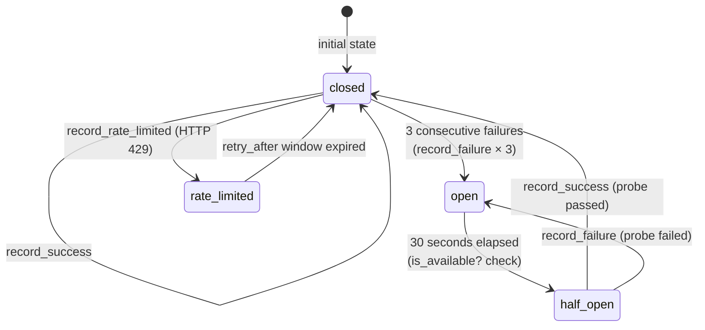

# Provider Routing Workflow

How a provider and model are selected for an LLM call, from signal weight through
tier mapping, provider availability, and fallback chain execution.

Source: `lib/optimal_system_agent/providers/registry.ex`,
`lib/optimal_system_agent/providers/health_checker.ex`,
`lib/optimal_system_agent/agent/tier.ex`.

---

## Mermaid Flowchart

```mermaid
flowchart TD
    A([Agent.Loop requests LLM call]) --> B{Session has provider override?}

    B -->|Yes: :osa_session_provider_overrides ETS| C[Use override provider + model]
    B -->|No| D{Signal weight available?}

    D -->|weight present| E{Determine tier from weight}
    D -->|no weight| F[Use default tier: :specialist]

    E -->|weight < 0.35| G[Tier: :utility]
    E -->|0.35 ≤ weight < 0.65| H[Tier: :specialist]
    E -->|weight ≥ 0.65| I[Tier: :elite]

    G --> J[Agent.Tier.model_for :utility, provider]
    H --> J[Agent.Tier.model_for :specialist, provider]
    I --> J[Agent.Tier.model_for :elite, provider]
    F --> J

    J --> K{Provider is :ollama?}

    K -->|Yes| L{:persistent_term :osa_ollama_tiers available?}
    L -->|Yes: Ollama probed at boot| M[Use auto-detected model for tier<br/>largest=elite, mid=specialist, small=utility]
    L -->|No: Ollama not probed or no models| N[Use app config :ollama_model or default]
    M --> O[Resolved: provider + model]
    N --> O
    K -->|No: cloud provider| P[Lookup tier in @tier_models map<br/>e.g. anthropic → elite → claude-opus-4-6]
    C --> O
    P --> O

    O --> Q[Loop.LLMClient.llm_chat / llm_chat_stream]
    Q --> R[Providers.Registry.chat / chat_stream with provider: + model:]

    R --> S{HealthChecker.is_available? provider}
    S -->|false: circuit open or rate-limited| T[Skip to fallback chain immediately]
    S -->|true| U[with_retry — attempt provider call]

    U --> V{Provider response}
    V -->|{:ok, result}| W[HealthChecker.record_success]
    W --> X([Return result to Loop])

    V -->|{:error, {:rate_limited, retry_after}}| Y{Attempt <= 3?}
    Y -->|Yes| Z[Sleep Retry-After seconds, max 60s<br/>Exponential backoff if nil]
    Z --> U
    Y -->|No| AA[HealthChecker.record_rate_limited]
    AA --> T

    V -->|{:error, reason}| BB[HealthChecker.record_failure]
    BB --> CC{3 consecutive failures?}
    CC -->|Yes| DD[Circuit → :open<br/>HealthChecker opens circuit]
    CC -->|No| T
    DD --> T

    T --> EE{Fallback chain configured?<br/>config :fallback_chain}
    EE -->|No chain| FF([Return error to Loop])

    EE -->|Chain exists| GG[Filter chain:<br/>1. Remove failed provider<br/>2. Remove boot-excluded Ollama<br/>3. Filter unavailable via HealthChecker.is_available?]

    GG --> HH{Any available providers remain?}
    HH -->|No| FF

    HH -->|Yes| II[Try next provider in chain<br/>Providers.chat_with_fallback]

    II --> JJ{Provider response}
    JJ -->|{:ok, result}| X
    JJ -->|{:error, reason}| KK{More providers in chain?}
    KK -->|Yes| II
    KK -->|No| FF
```

---

## Circuit Breaker State Machine

`Providers.HealthChecker` maintains a per-provider state machine:



States:
- `:closed` — provider healthy, requests flow normally
- `:open` — provider failed repeatedly; `is_available?` returns `false`
- `:half_open` — 30s cooldown expired; next call is a probe
- Rate-limited sub-state — `is_available?` returns `false` until window expires

Thresholds (in `Providers.HealthChecker`):
- `@failure_threshold 3` — opens circuit after 3 consecutive failures
- `@open_timeout_ms 30_000` — half-opens after 30 seconds
- `@default_rate_limit_ms 60_000` — default rate limit window when no Retry-After header

---

## Provider Registry

18 providers registered at compile time in `Providers.Registry.@providers`:

| Category | Providers |
|---|---|
| Local | `:ollama` |
| Native API | `:anthropic`, `:google`, `:cohere`, `:replicate` |
| OpenAI-compatible | `:openai`, `:groq`, `:together`, `:fireworks`, `:deepseek`, `:perplexity`, `:mistral`, `:openrouter` |
| Chinese providers | `:qwen`, `:moonshot`, `:zhipu`, `:volcengine`, `:baichuan` |

OpenAI-compatible providers (13 of 18) are routed through a single
`Providers.OpenAICompatProvider` module with the provider atom indicating which
base URL and auth header format to use.

---

## Tier-to-Model Mapping (Selected Providers)

| Tier | Anthropic | OpenAI | Groq | Ollama |
|---|---|---|---|---|
| `:elite` | claude-opus-4-6 | gpt-4o | llama-3.3-70b-versatile | largest installed |
| `:specialist` | claude-sonnet-4-6 | gpt-4o-mini | llama-3.1-70b-versatile | mid-size installed |
| `:utility` | claude-haiku-4-5 | gpt-3.5-turbo | llama-3.1-8b-instant | smallest installed |

Full mapping for all 18 providers is in `Agent.Tier.@tier_models`.

Ollama tier assignment is dynamic: `detect_ollama_tiers/0` queries `GET /api/tags`,
sorts installed models by file size, and assigns tiers. Result is cached in
`persistent_term :osa_ollama_tiers` and survives GenServer restarts.

---

## Boot-time Ollama Probe

During `Providers.Registry.init/1`, Ollama reachability is probed via
`Providers.Ollama.reachable?/0`. If Ollama is not reachable:

1. `Process.put(:osa_ollama_excluded, true)` is set in the Registry process.
2. `filter_boot_excluded_providers/1` removes `:ollama` from all fallback chains.
3. No `:econnrefused` log lines appear for subsequent LLM calls.

The exclusion persists for the lifetime of the Registry GenServer. If Ollama starts
later, the exclusion is not automatically cleared. To clear it, restart
`Providers.Registry` or use the hot-swap override API.

---

## Session Provider Override

A per-session provider and model can be overridden at runtime without restarting:

**Via ETS (internal):**
```elixir
:ets.insert(:osa_session_provider_overrides, {session_id, :groq, "llama-3.3-70b-versatile"})
```

**Via HTTP API:**
```bash
POST /sessions/{id}/provider
{"provider": "groq", "model": "llama-3.3-70b-versatile"}
```

**Via CLI:**
```
/model groq llama-3.3-70b-versatile
```

The override is read in `Loop.LLMClient.llm_chat/3` before the tier resolution step
and takes precedence over all tier-based routing.
