# Request Processing Flow

## Overview

This diagram shows the full lifecycle of a user message from channel receipt to
final response delivery. Hook intercept points are shown where the hook pipeline
can modify or halt execution. The tool execution sub-loop repeats until the LLM
stops issuing tool calls or the iteration limit (20) is reached.

---

## Request Processing Sequence

```mermaid
sequenceDiagram
    autonumber
    participant User as User
    participant Channel as Channel Adapter\n(CLI / HTTP / Telegram / ...)
    participant NoiseFilter as Channels.NoiseFilter
    participant Guardrails as Loop.Guardrails
    participant HooksPre as Agent.Hooks\n(pre_message)
    participant Memory as Agent.Memory
    participant Context as Agent.Context
    participant HooksPreLLM as Agent.Hooks\n(pre_llm)
    participant LLM as Providers.Registry\n(goldrush router)
    participant HooksPostLLM as Agent.Hooks\n(post_llm)
    participant ToolExec as Loop.ToolExecutor
    participant HooksPreTool as Agent.Hooks\n(pre_tool)
    participant Tool as Tools.Registry\n(goldrush dispatcher)
    participant HooksPostTool as Agent.Hooks\n(post_tool)
    participant EventBus as Events.Bus
    participant HooksPost as Agent.Hooks\n(post_message)

    User->>Channel: sends message

    rect rgb(255, 248, 240)
        note over Channel,NoiseFilter: Phase 1 — Noise filtering (before Loop)
        Channel->>NoiseFilter: NoiseFilter.check(message, signal_weight)
        alt Tier 1: deterministic regex match (< 1ms)
            NoiseFilter-->>Channel: {:noise, :definitely | :likely}
            Channel-->>User: lightweight acknowledgment (no LLM call)
        else Tier 2: signal weight below threshold
            NoiseFilter-->>Channel: {:noise, :uncertain}
            Channel-->>User: clarification request (no LLM call)
        else Signal passes filter
            NoiseFilter-->>Channel: :signal
        end
    end

    Channel->>EventBus: Events.Bus.emit(:user_message, ...)
    Channel->>Channel: Agent.Loop.send_message(session_id, message)

    rect rgb(240, 255, 240)
        note over Guardrails: Phase 2 — Prompt injection detection (in Loop)
        Channel->>Guardrails: Guardrails.check(message)
        alt Tier 1: regex on raw input
            Guardrails-->>Channel: {:block, :prompt_injection}
            Channel-->>User: refusal response (no LLM call)
        else Tier 2: regex on normalized unicode input
            Guardrails-->>Channel: {:block, :prompt_injection}
            Channel-->>User: refusal response
        else Tier 3: structural analysis (SYSTEM:, XML tags)
            Guardrails-->>Channel: {:block, :structural_injection}
            Channel-->>User: refusal response
        else Clean input
            Guardrails-->>Channel: :ok
        end
    end

    rect rgb(240, 248, 255)
        note over HooksPre,Memory: Phase 3 — Pre-processing hooks + memory
        Channel->>HooksPre: Hooks.run_pre_message(message, session)
        HooksPre-->>Channel: :ok | {:halt, reason}

        Channel->>Memory: Memory.store(:user_message, content, session_id)
        Memory-->>Channel: :ok

        Channel->>Memory: Memory.recall(message, session_id)
        Memory-->>Channel: relevant_memories[]

        Channel->>Context: Context.build(session_id, message, relevant_memories)
        Context-->>Channel: context_window (messages[], system_prompt, tools[])
    end

    rect rgb(248, 240, 255)
        note over HooksPreLLM,LLM: Phase 4 — LLM call with spend guard
        Channel->>HooksPreLLM: Hooks.run_pre_llm(context_window, session)
        note right of HooksPreLLM: spend_guard hook:\nMiosaBudget.Budget.check_budget/0
        alt Budget exceeded
            HooksPreLLM-->>Channel: {:halt, :budget_exceeded}
            Channel-->>User: "Token budget exceeded"
        else Budget OK
            HooksPreLLM-->>Channel: {:ok, context_window}
        end

        Channel->>EventBus: Events.Bus.emit(:llm_request, ...)
        Channel->>LLM: Providers.Registry.chat_stream(messages, callback, opts)
        note right of LLM: goldrush :osa_provider_router\nfallback chain: Anthropic → OpenAI → Groq → Ollama\nHealthChecker.is_available?(provider) per attempt
        LLM-->>Channel: {:ok, response}
        Channel->>EventBus: Events.Bus.emit(:llm_response, ...)

        Channel->>HooksPostLLM: Hooks.run_post_llm(response, session)
        note right of HooksPostLLM: learning capture hook:\nAgent.Learning.observe/1\ntelemetry hook:\nTelemetry.Metrics.record/1
        HooksPostLLM-->>Channel: {:ok, response}
    end

    rect rgb(255, 255, 240)
        note over ToolExec,HooksPostTool: Phase 5 — Tool execution loop (0 to 20 iterations)
        loop while response.tool_calls not empty AND iteration < 20
            Channel->>ToolExec: ToolExecutor.execute_tools(tool_calls, session)

            ToolExec->>HooksPreTool: Hooks.run_pre_tool(tool_name, params, session)
            note right of HooksPreTool: safety hook: check tool safety level\nread-before-write hook: check osa_files_read ETS
            alt Hook halts tool
                HooksPreTool-->>ToolExec: {:halt, reason}
                ToolExec-->>Channel: tool_result = {:error, reason}
            else Hook allows
                HooksPreTool-->>ToolExec: {:ok, params}

                ToolExec->>EventBus: Events.Bus.emit(:tool_call, ...)
                ToolExec->>Tool: Tools.Registry.execute(tool_name, params)
                note right of Tool: goldrush :osa_tool_dispatcher\nroutes to: built-in tools | MCP tools | sidecar tools
                alt Tool success
                    Tool-->>ToolExec: {:ok, result}
                else Tool error
                    Tool-->>ToolExec: {:error, reason}
                    note right of ToolExec: Error returned to LLM as tool_result\nLLM decides: retry, alternate approach,\nor surface to user
                else Sandbox timeout
                    Tool-->>ToolExec: {:error, :timeout}
                end
                ToolExec->>EventBus: Events.Bus.emit(:tool_result, ...)

                ToolExec->>HooksPostTool: Hooks.run_post_tool(tool_name, result, session)
                HooksPostTool-->>ToolExec: :ok

                ToolExec-->>Channel: tool_results[]
            end

            Channel->>Memory: Memory.store(:tool_result, tool_results, session_id)

            Channel->>HooksPreLLM: Hooks.run_pre_llm(updated_context, session)
            Channel->>LLM: Providers.Registry.chat_stream(messages + tool_results, ...)
            LLM-->>Channel: {:ok, next_response}
            Channel->>HooksPostLLM: Hooks.run_post_llm(next_response, session)
        end
    end

    rect rgb(240, 255, 255)
        note over Memory,HooksPost: Phase 6 — Response persistence + post-hooks
        Channel->>Guardrails: Guardrails.check_output(response)
        note right of Guardrails: Output guard: check for system prompt echo\nusing @system_prompt_fingerprints
        alt Output contains system prompt leakage
            Guardrails-->>Channel: {:replace, refusal_text}
        else Output clean
            Guardrails-->>Channel: :ok
        end

        Channel->>Memory: Memory.store(:assistant_message, response, session_id)
        Memory-->>Channel: :ok

        Channel->>HooksPost: Hooks.run_post_message(response, session)
        note right of HooksPost: episodic memory hook:\nMiosaMemory.Episodic.record/3\nlearning consolidation hook
        HooksPost-->>Channel: :ok

        Channel->>EventBus: Events.Bus.emit(:agent_response, ...)
        EventBus->>EventBus: fan-out to subscribers\n(Bridge.PubSub → SSE clients\nTelemetry.Metrics\nPlatform.AMQP if enabled)
    end

    Channel-->>User: final response (streaming or complete)
```

---

## Hook Intercept Points Summary

| Hook Point | Location in Flow | Can Halt? | Default Hooks |
|---|---|---|---|
| `pre_message` | After noise filter, before memory | Yes | Safety classifier |
| `pre_llm` | Before every LLM API call | Yes | `spend_guard`, context validator |
| `post_llm` | After every LLM API response | No | Learning capture, telemetry |
| `pre_tool` | Before every tool execution | Yes | Safety check, read-before-write |
| `post_tool` | After every tool result | No | Telemetry, episodic memory |
| `post_message` | After full turn completes | No | Episodic memory, learning consolidation |

---

## Iteration Guard

The tool execution loop is bounded by a maximum iteration count, configurable
per session. The default is 20 iterations per agent turn.

If the iteration limit is reached:
1. The last LLM response (partial or complete) is used as the turn result
2. A notice is appended: "Maximum tool iterations reached"
3. The response is persisted and delivered to the user
4. A `system_event` is emitted to `Events.Bus` for monitoring

An iteration is defined as one complete round-trip: tool calls extracted from
LLM response + tool execution + tool results appended to context + next LLM call.

---

## Error Handling Summary

| Error | At | Recovery |
|---|---|---|
| Noise detected | NoiseFilter | Lightweight ack, no LLM call |
| Prompt injection | Guardrails | Refusal message, no LLM call |
| Hook halts execution | Any pre_* hook | Halt reason returned to user |
| Budget exceeded | pre_llm hook | Budget exceeded message to user |
| LLM provider failure | Providers.Registry | Automatic fallback to next chain member |
| All providers down | Providers.Registry | `{:error, :no_providers_available}` to user |
| Tool not found | Tools.Registry | `{:error, :unknown_tool}` returned as tool result |
| Tool execution error | Tools.Registry | Error returned to LLM as tool result |
| Sandbox timeout | Tool.execute | `{:error, :timeout}` returned to LLM |
| System prompt echo | Output Guardrails | Response replaced with refusal text |
| Iteration limit | Loop | Last response delivered with notice |
