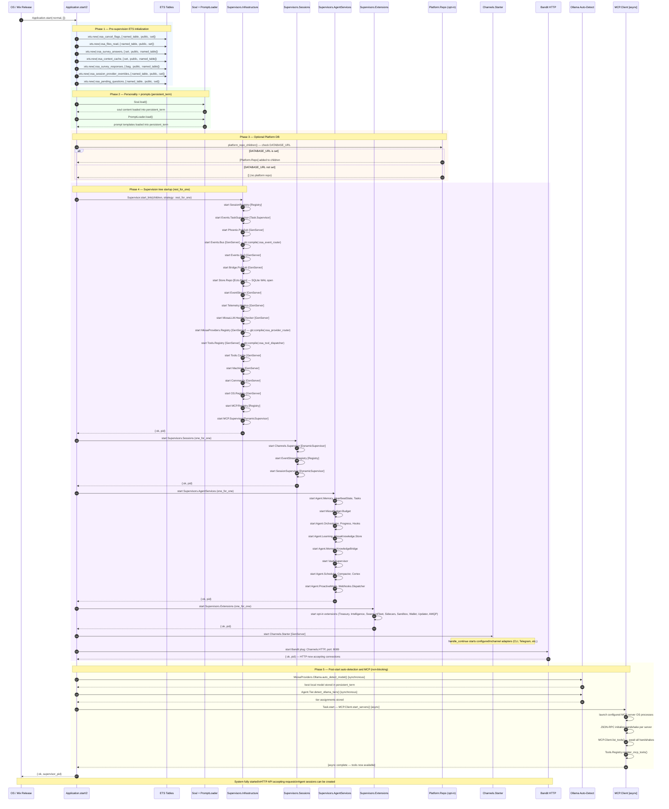

# Startup Flow

## Overview

This diagram shows the complete startup sequence from `Application.start/2`
to the first request being accepted. Steps are ordered as they occur in time.
Steps marked `[async]` do not block the main startup path.

---

## Startup Sequence Diagram

---

## Startup Time Budget

| Phase | Typical duration | Notes |
|---|---|---|
| ETS initialization | < 1 ms | 7 table creations |
| Soul + PromptLoader | 10–50 ms | Disk reads, persistent_term writes |
| Platform.Repo (if enabled) | 50–200 ms | PostgreSQL connect + schema check |
| Infrastructure supervisor | 20–100 ms | goldrush compile = 5–20 ms per router |
| Sessions + AgentServices + Extensions | 10–50 ms | GenServer init callbacks |
| Channels.Starter | 5–20 ms | Channel adapter handshakes |
| Bandit HTTP | < 5 ms | Socket bind + listen |
| Ollama auto-detect (synchronous) | 50–500 ms | HTTP call to local Ollama |
| MCP server startup (async) | 1–10 s | Depends on server count and latency |

Total blocking startup (before HTTP accepts): typically 100–500 ms on a
local machine without PostgreSQL. MCP startup is async and does not
contribute to the blocking time.

---

## Startup Failure Modes

| Component | Failure | Behavior |
|---|---|---|
| ETS table creation | Name collision | `ArgumentError` raised — BEAM halts |
| Soul.load() | File not found | Warning logged; default identity used |
| Infrastructure supervisor | Child init failure | Supervisor crashes; BEAM halts (permanent process) |
| Store.Repo | SQLite file locked | Repo crashes; Infrastructure crashes; BEAM halts |
| Bandit HTTP | Port 8089 in use | `{:error, :eaddrinuse}` — BEAM halts |
| Ollama auto-detect | Ollama not running | Warning logged; Ollama marked unavailable |
| MCP server startup | Server binary missing | Warning logged; server skipped |
